```R
options(jupyter.plot_mimetypes = c("text/plain", "image/png" )) # to ensure better graphs?
```

# Separability measures
For a cloud with tokens from all types


```R
library(semvar); library(RcppCNPy); library(rjson); library(repr)
```

Function to read the original distance matrices (before multidimensional scaling)


```R
get_tokvecs <- function(input_directory, filename){
  input_file = paste0(input_directory, filename)
  temp <- unzip(input_file, unzip="internal")
  tokvecs <- npyLoad(temp[2])
  metadata <- fromJSON(file=temp[1])
  dimid2item <- names(metadata$`dim-freq-dict`)
  dimnames(tokvecs) <- list(dimid2item, dimid2item)
  file.remove(temp[1], temp[2])
  return(tokvecs)
}
```

Loading variables for classification


```R
semcor = read.delim('../semcor.data.csv')
```


```R
get_d <- function(tokvecs){
  d.rows <- data.frame(factor(rownames(tokvecs)))
  colnames(d.rows)<-'id'
  d <- merge.data.frame(d.rows, semcor, by='id')
  return(droplevels(d))
}
```

Creating a dataframe with filenames and parameters, to select the correct filenames by selecting the parameters of the cloud.


```R
tokvecs_dir = "/home/mariana/Python3wf/output/token_matrices/COHAweight/"
nomds_files = data.frame(factor(dir(tokvecs_dir)))
colnames(nomds_files)='files'
```


```R
pattern = '^COHA.([a-z_]+)(.sample)?.socc(10k|6k).(nona|info|imag|others|tech)?.?min(\\d(_5)?).ttmx.dist.pac'
nomds_files$subset = gsub(pattern, '\\1', nomds_files$files)
nomds_files$socc = gsub(pattern, '\\3', nomds_files$files)
nomds_files$subsubset = gsub(pattern,'\\4', nomds_files$files)
nomds_files$threshold = gsub(pattern, '\\5', nomds_files$files)
nomds_files[nomds_files$subsubset != 'nona', 'subsubset']<-'all'
```

Doing the same for clouds after MDS


```R
clouds_dir = "/home/mariana/delhikiev.github.io/COHAweight/"
mds_files = data.frame(factor(dir(clouds_dir, pattern='.+tsv')))
colnames(mds_files)='files'
```


```R
pattern = '^COHA.([a-z_]+)(.sample)?.socc(10k|6k).(nona|info|imag|tech|others)?.?min(\\d(_5)?).tsv'
mds_files$subset = gsub(pattern, '\\1', mds_files$files)
mds_files$socc = gsub(pattern, '\\3', mds_files$files)
mds_files$subsubset = gsub(pattern,'\\4', mds_files$files)
mds_files$threshold = gsub(pattern, '\\5', mds_files$files)
mds_files[mds_files$subsubset != 'nona', 'subsubset']<-'all'
```

Selecting parameters


```R
subset = 'country'
nona = 'all'
threshold = '1'
```


```R
tokvecs6_fn = as.character(nomds_files[nomds_files$subset == subset & nomds_files$socc == '6k' & nomds_files$threshold == threshold & nomds_files$subsubset == nona, 'files'])
tokvecs10_fn = as.character(nomds_files[nomds_files$subset == subset & nomds_files$socc == '10k' & nomds_files$threshold == threshold & nomds_files$subsubset == nona, 'files'])
```


```R
cloud6_fn = as.character(mds_files[mds_files$subset == subset & mds_files$socc == '6k' & mds_files$threshold == threshold & mds_files$subsubset == nona, 'files'])
cloud10_fn = as.character(mds_files[mds_files$subset == subset & mds_files$socc == '10k' & mds_files$threshold == threshold & mds_files$subsubset == nona, 'files'])
```

Loading the files and getting dataframes.
* _tokvecs_ are the distance matrices before MDS.
* _d_ are dataframes with the categorial data for the tokens in the distance matrices.
* _c_ are the clouds after MDS: these dataframes include the coordinates for the clouds and categorial data.
* _coord_ are the columns with the coordinates of the clouds from the _c_ dataframes.
* _dist_ are the distance matrices built from _coord_.

The order of the tokens is the same in all cases: the _c_ dataframes were originally generated from the _tokvecs_ files and the _d_ dataframes were created with _merge.data.frame_, prioritizing the order of _tokvecs_ over the _semcor.data.csv_ dataframe.


```R
tokvecs6 <-get_tokvecs(tokvecs_dir, tokvecs6_fn)
tokvecs10 <-get_tokvecs(tokvecs_dir, tokvecs10_fn)
```


```R
d6 <- get_d(tokvecs6)
d10 <- get_d(tokvecs10)
```

Delete the rows without mari-senses (with NAs, which had been transformed to 'Z') to avoid senseless tiny classes.


```R
if (length(which(d6$mari2=='Z')>0)){
    tokvecs6<-tokvecs6[-which(d6$mari2=='Z'),-which(d6$mari2=='Z')]
    d6<-droplevels(d6[-which(d6$mari2=='Z'),])
    tokvecs10<-tokvecs10[-which(d10$mari2=='Z'),-which(d10$mari2=='Z')]
    d10<-droplevels(d10[-which(d10$mari2=='Z'),])
    }
```


```R
c6 <- read.delim(paste0(clouds_dir, cloud6_fn))
c10 <- read.delim(paste0(clouds_dir, cloud10_fn))
coord6 <- c6[,c('model.x', 'model.y')]
coord10 <- c10[,c('model.x', 'model.y')]
dist6<-dist(coord6)
dist10 <-dist(coord10)
```

## Distance Ratio
General measure


```R
dr_tokvecs <- function(clusterclass){
    semvar6<-clusterqualDR(tokvecs6, d6[,clusterclass])
    semvar10<-clusterqualDR(tokvecs10, d10[,clusterclass])
    make_col <- function(semvardf, df_name){
        freqs <- as.vector(semvardf$classfreqs)
        n <- c(sum(freqs), length(freqs), freqs)
        q <- round(c(semvardf$globqual, semvardf$meanclassqual, semvardf$classqual),3)
        q2 <- round(c(semvardf$globqual2, semvardf$meanclassqual2, semvardf$classqual2),3)
        d<-cbind(n, q, q2)
        row.names(d)<-c('global separability', 'mean class separability', names(semvardf$classqual))
        colnames(d)<-c(paste0(df_name, '_n'), paste0(df_name, '_q'), paste0(df_name, "_q'"))
        return(d)
    }
    cat(paste0('Distance ratio based separability, based on ', clusterclass), '\n')
    print(cbind(make_col(semvar6, '6k'), make_col(semvar10, '10k')))
    options(repr.plot.width=5, repr.plot.height=5)
    plot(semvar6, coord6)
    plot(semvar10, coord10)
    }
```


```R
dr_clouds <- function(clusterclass){
    semvar6<-clusterqualDR(dist6, c6[,clusterclass])
    semvar10<-clusterqualDR(dist10, c10[,clusterclass])
    make_col <- function(semvardf, df_name){
        freqs <- as.vector(semvardf$classfreqs)
        n <- c(sum(freqs), length(freqs), freqs)
        q <- round(c(semvardf$globqual, semvardf$meanclassqual, semvardf$classqual),3)
        q2 <- round(c(semvardf$globqual2, semvardf$meanclassqual2, semvardf$classqual2),3)
        d<-cbind(n, q, q2)
        row.names(d)<-c('global separability', 'mean class separability', names(semvardf$classqual))
        colnames(d)<-c(paste0(df_name, '_n'), paste0(df_name, '_q'), paste0(df_name, "_q'"))
        return(d)
    }
    cat(paste0('Distance ratio based separability, based on ', clusterclass), '\n')
    print(cbind(make_col(semvar6, '6k'), make_col(semvar10, '10k')))
    options(repr.plot.width=5, repr.plot.height=5)
    plot(semvar6, coord6)
    plot(semvar10, coord10)
    }
```


```R
dr_tokvecs('mbroad')
```

    Distance ratio based separability, based on mbroad 
                            6k_n  6k_q 6k_q' 10k_n 10k_q 10k_q'
    global separability      337 1.069 1.060   337 1.114  1.106
    mean class separability    2 1.044 1.029     2 1.071  1.068
    A                         46 1.010 0.988    46 1.012  1.013
    B                        291 1.078 1.070   291 1.131  1.123


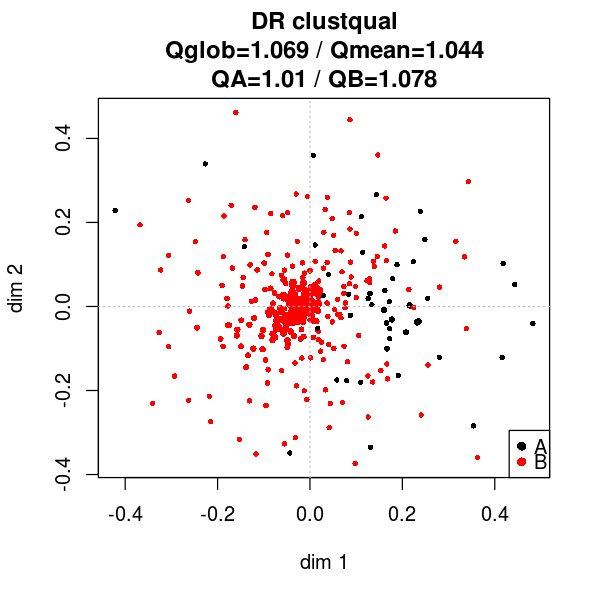


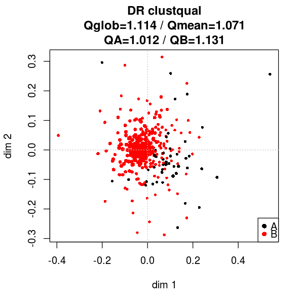


```R
dr_clouds('mbroad')
```

    Distance ratio based separability, based on mbroad 
                            6k_n  6k_q 6k_q' 10k_n 10k_q 10k_q'
    global separability      337 1.553 1.822   337 1.582  1.687
    mean class separability    2 1.374 1.684     2 1.360  1.570
    A                         46 1.128 1.385    46 1.056  1.348
    B                        291 1.620 1.983   291 1.665  1.793


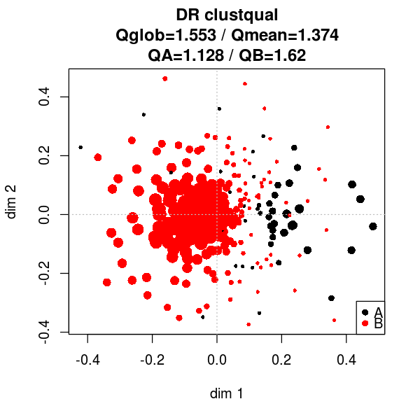


## Silhouette based
General measure


```R
sil_tokvecs <- function(clusterclass){
    semvar6<-clusterqualSIL(tokvecs6, d6[,clusterclass])
    semvar10<-clusterqualSIL(tokvecs10, d10[,clusterclass])
    make_col <- function(semvardf, df_name){
        freqs <- as.vector(semvardf$classfreqs)
        n <- c(sum(freqs), length(freqs), freqs)
        q <- round(c(semvardf$globqual, semvardf$meanclassqual, semvardf$classqual),3)
        d<-cbind(n, q)
        row.names(d)<-c('global separability', 'mean class separability', names(semvardf$classqual))
        colnames(d)<-c(paste0(df_name, '_n'), paste0(df_name, '_q'))
        return(d)
    }
    cat(paste0('Silhouette based separability, based on ', clusterclass), '\n')
    print(cbind(make_col(semvar6, '6k'), make_col(semvar10, '10k')))
    options(repr.plot.width=5, repr.plot.height=5)
    plot(semvar6, coord6)
    plot(semvar10, coord10)
    }
```


```R
sil_clouds <- function(clusterclass){
    semvar6<-clusterqualSIL(dist6, c6[,clusterclass])
    semvar10<-clusterqualSIL(dist10, c10[,clusterclass])
    make_col <- function(semvardf, df_name){
        freqs <- as.vector(semvardf$classfreqs)
        n <- c(sum(freqs), length(freqs), freqs)
        q <- round(c(semvardf$globqual, semvardf$meanclassqual, semvardf$classqual),3)
        d<-cbind(n, q)
        row.names(d)<-c('global separability', 'mean class separability', names(semvardf$classqual))
        colnames(d)<-c(paste0(df_name, '_n'), paste0(df_name, '_q'))
        return(d)
    }
    cat(paste0('Silhouette based separability, based on ', clusterclass), '\n')
    print(cbind(make_col(semvar6, '6k'), make_col(semvar10, '10k')))
    options(repr.plot.width=5, repr.plot.height=5)
    plot(semvar6, coord6)
    plot(semvar10, coord10)
    }
```


```R
sil_tokvecs('mbroad')
```

    Silhouette based separability, based on mbroad 
                            6k_n  6k_q 10k_n 10k_q
    global separability      337 0.062   337 0.098
    mean class separability    2 0.039     2 0.061
    A                         46 0.008    46 0.010
    B                        291 0.071   291 0.112


```R
sil_clouds('mbroad')
```

    Silhouette based separability, based on mbroad 
                            6k_n  6k_q 10k_n 10k_q
    global separability      337 0.300   337 0.307
    mean class separability    2 0.207     2 0.189
    A                         46 0.080    46 0.027
    B                        291 0.335   291 0.351


## Same Class Paths based
Local measure


```R
scp_tokvecs <- function(clusterclass, k=NULL, b=FALSE){
    semvar6<-clusterqualSCP(tokvecs6, d6[,clusterclass], k=k, backtracking=b)
    semvar10<-clusterqualSCP(tokvecs10, d10[,clusterclass], k=k, backtracking=b)
    make_col <- function(semvardf, df_name){
        freqs <- as.vector(semvardf$classfreqs)
        n <- c(sum(freqs), length(freqs), freqs)
        q <- round(c(semvardf$globqual, semvardf$meanclassqual, semvardf$classqual),3)
        d<-cbind(n, q)
        row.names(d)<-c('global separability', 'mean class separability', names(semvardf$classqual))
        colnames(d)<-c(paste0(df_name, '_n'), paste0(df_name, '_q'))
        return(d)
    }
    cat(paste0('Same Class Paths based separability, based on ', clusterclass), '\n')
    cat(paste0('k: ', semvar6$k, '; Backtracking: ', semvar6$backtracking, '\n'))
    print(cbind(make_col(semvar6, '6k'), make_col(semvar10, '10k')))
    options(repr.plot.width=5, repr.plot.height=5)
    plot(semvar6, coord6)
    plot(semvar10, coord10)
    }
```


```R
scp_clouds <- function(clusterclass, k=NULL, b=FALSE){
    semvar6<-clusterqualSCP(dist6, c6[,clusterclass], k=k, backtracking=b)
    semvar10<-clusterqualSCP(dist10, c10[,clusterclass], k=k, backtracking=b)
    make_col <- function(semvardf, df_name){
        freqs <- as.vector(semvardf$classfreqs)
        n <- c(sum(freqs), length(freqs), freqs)
        q <- round(c(semvardf$globqual, semvardf$meanclassqual, semvardf$classqual),3)
        d<-cbind(n, q)
        row.names(d)<-c('global separability', 'mean class separability', names(semvardf$classqual))
        colnames(d)<-c(paste0(df_name, '_n'), paste0(df_name, '_q'))
        return(d)
    }
    cat(paste0('Same Class Paths based separability, based on ', clusterclass), '\n')
    cat(paste0('k: ', semvar6$k, '; Backtracking: ', semvar6$backtracking, '\n'))
    print(cbind(make_col(semvar6, '6k'), make_col(semvar10, '10k')))
    options(repr.plot.width=5, repr.plot.height=5)
    plot(semvar6, coord6)
    plot(semvar10, coord10)
    }
```


```R
scp_tokvecs('mbroad', k=10)
```

    Same Class Paths based separability, based on mbroad 
    k: 10; Backtracking: 1
                            6k_n  6k_q 10k_n 10k_q
    global separability      337 0.887   337 0.916
    mean class separability    2 0.702     2 0.754
    A                         46 0.449    46 0.531
    B                        291 0.956   291 0.977


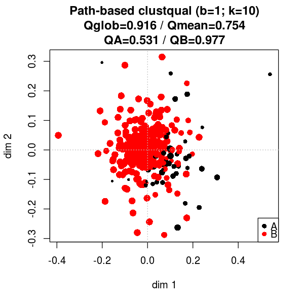


```R
scp_clouds('mbroad', k=10)
```

    Same Class Paths based separability, based on mbroad 
    k: 10; Backtracking: 1
                            6k_n  6k_q 10k_n 10k_q
    global separability      337 0.869   337 0.831
    mean class separability    2 0.715     2 0.617
    A                         46 0.502    46 0.322
    B                        291 0.928   291 0.912


```R
scp_tokvecs('newBroadGenre')
```

    Same Class Paths based separability, based on newBroadGenre 
    k: 32; Backtracking: 1
                            6k_n  6k_q 10k_n 10k_q
    global separability      337 0.669   337 0.863
    mean class separability    2 0.380     2 0.487
    imaginative               33 0.021    33 0.019
    informative              304 0.740   304 0.955


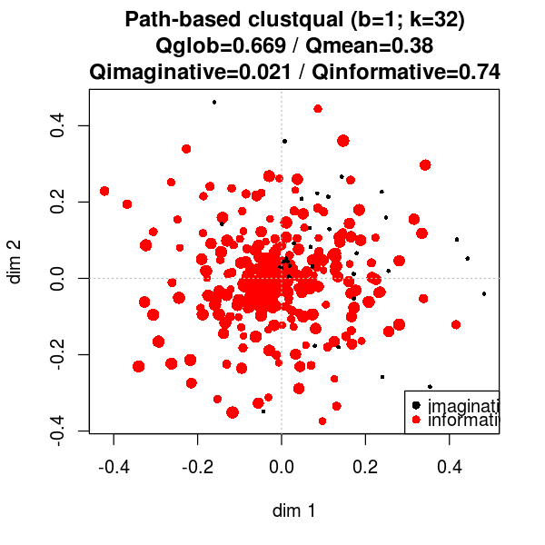


```R
scp_clouds('newBroadGenre')
```

    Same Class Paths based separability, based on newBroadGenre 
    k: 32; Backtracking: 1
                            6k_n  6k_q 10k_n 10k_q
    global separability      337 0.821   337 0.843
    mean class separability    2 0.481     2 0.498
    imaginative               33 0.059    33 0.068
    informative              304 0.904   304 0.928


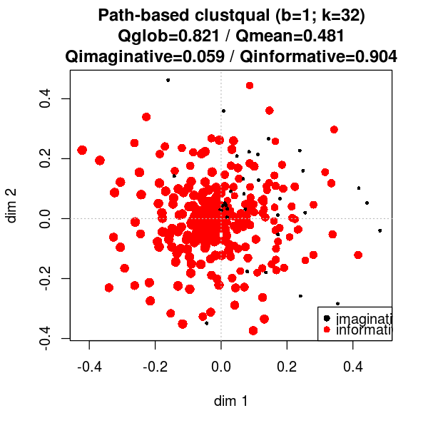


```R
scp_tokvecs('newBroadGenre', k=15)
```

    Same Class Paths based separability, based on newBroadGenre 
    k: 15; Backtracking: 1
                            6k_n  6k_q 10k_n 10k_q
    global separability      337 0.715   337 0.873
    mean class separability    2 0.435     2 0.514
    imaginative               33 0.087    33 0.068
    informative              304 0.783   304 0.960


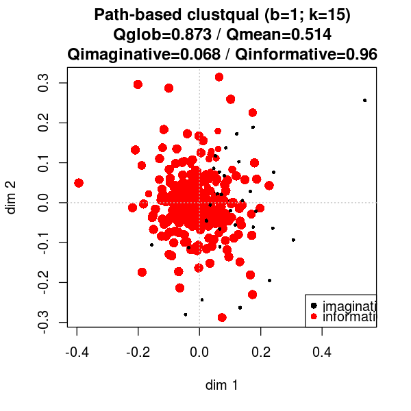


```R
scp_clouds('newBroadGenre', k=15)
```

    Same Class Paths based separability, based on newBroadGenre 
    k: 15; Backtracking: 1
                            6k_n  6k_q 10k_n 10k_q
    global separability      337 0.831   337 0.841
    mean class separability    2 0.508     2 0.509
    imaginative               33 0.108    33 0.095
    informative              304 0.909   304 0.922


```R
scp_tokvecs('newBroadGenre', k=10)
```

    Same Class Paths based separability, based on newBroadGenre 
    k: 10; Backtracking: 1
                            6k_n  6k_q 10k_n 10k_q
    global separability      337 0.769   337 0.873
    mean class separability    2 0.483     2 0.525
    imaginative               33 0.127    33 0.092
    informative              304 0.838   304 0.958


```R
scp_clouds('newBroadGenre', k=10)
```

    Same Class Paths based separability, based on newBroadGenre 
    k: 10; Backtracking: 1
                            6k_n  6k_q 10k_n 10k_q
    global separability      337 0.838   337 0.848
    mean class separability    2 0.521     2 0.534
    imaginative               33 0.128    33 0.143
    informative              304 0.915   304 0.924


```R
scp_tokvecs('newBroadGenre', k=15, b=2)
```

    Same Class Paths based separability, based on newBroadGenre 
    k: 15; Backtracking: 2
                            6k_n  6k_q 10k_n 10k_q
    global separability      337 0.788   337 0.875
    mean class separability    2 0.483     2 0.521
    imaginative               33 0.103    33 0.081
    informative              304 0.863   304 0.962


```R
scp_clouds('newBroadGenre', k=15, b=2)
```

    Same Class Paths based separability, based on newBroadGenre 
    k: 15; Backtracking: 2
                            6k_n  6k_q 10k_n 10k_q
    global separability      337 0.847   337 0.862
    mean class separability    2 0.537     2 0.556
    imaginative               33 0.153    33 0.176
    informative              304 0.922   304 0.937


```R
scp_tokvecs('broadGenre')
```

    Same Class Paths based separability, based on broadGenre 
    k: 32; Backtracking: 1
                            6k_n  6k_q 10k_n 10k_q
    global separability      337 0.347   337 0.425
    mean class separability    3 0.253     3 0.328
    imag                      33 0.021    33 0.019
    others                   194 0.418   194 0.434
    tech                     110 0.320   110 0.532


```R
scp_clouds('broadGenre')
```

    Same Class Paths based separability, based on broadGenre 
    k: 32; Backtracking: 1
                            6k_n  6k_q 10k_n 10k_q
    global separability      337 0.382   337 0.429
    mean class separability    3 0.285     3 0.318
    imag                      33 0.059    33 0.068
    others                   194 0.463   194 0.533
    tech                     110 0.334   110 0.353


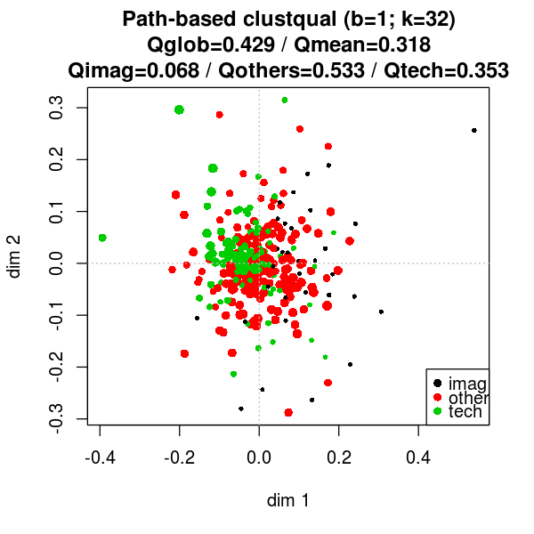


```R
scp_tokvecs('broadGenre', k=15)
```

    Same Class Paths based separability, based on broadGenre 
    k: 15; Backtracking: 1
                            6k_n  6k_q 10k_n 10k_q
    global separability      337 0.451   337 0.544
    mean class separability    3 0.352     3 0.439
    imag                      33 0.087    33 0.068
    others                   194 0.507   194 0.518
    tech                     110 0.461   110 0.732


```R
scp_clouds('broadGenre', k=15)
```

    Same Class Paths based separability, based on broadGenre 
    k: 15; Backtracking: 1
                            6k_n  6k_q 10k_n 10k_q
    global separability      337 0.431   337 0.468
    mean class separability    3 0.331     3 0.356
    imag                      33 0.108    33 0.095
    others                   194 0.529   194 0.564
    tech                     110 0.357   110 0.410


```R
scp_tokvecs('broadGenre', k=10)
```

    Same Class Paths based separability, based on broadGenre 
    k: 10; Backtracking: 1
                            6k_n  6k_q 10k_n 10k_q
    global separability      337 0.506   337 0.564
    mean class separability    3 0.401     3 0.455
    imag                      33 0.127    33 0.092
    others                   194 0.572   194 0.560
    tech                     110 0.503   110 0.712


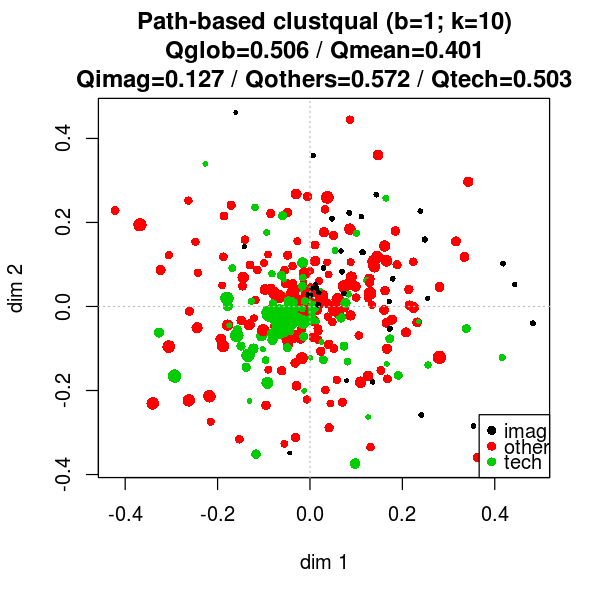


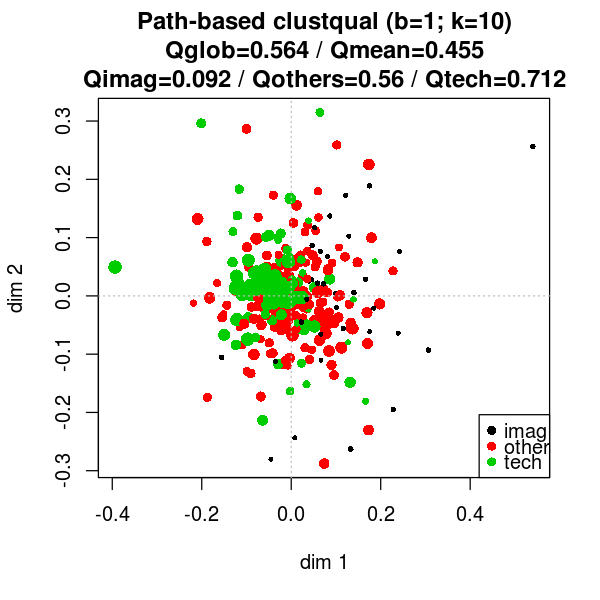


```R
scp_clouds('broadGenre', k=10)
```

    Same Class Paths based separability, based on broadGenre 
    k: 10; Backtracking: 1
                            6k_n  6k_q 10k_n 10k_q
    global separability      337 0.455   337 0.489
    mean class separability    3 0.353     3 0.385
    imag                      33 0.128    33 0.143
    others                   194 0.553   194 0.582
    tech                     110 0.379   110 0.430


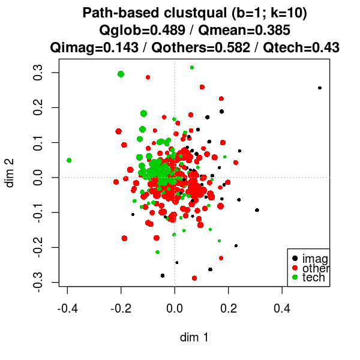


```R
scp_tokvecs('broadGenre', k=10, b=2)
```

    Same Class Paths based separability, based on broadGenre 
    k: 10; Backtracking: 2
                            6k_n  6k_q 10k_n 10k_q
    global separability      337 0.566   337 0.595
    mean class separability    3 0.456     3 0.486
    imag                      33 0.139    33 0.123
    others                   194 0.610   194 0.590
    tech                     110 0.617   110 0.746


```R
scp_clouds('broadGenre', k=10, b=2)
```

    Same Class Paths based separability, based on broadGenre 
    k: 10; Backtracking: 2
                            6k_n  6k_q 10k_n 10k_q
    global separability      337 0.486   337 0.534
    mean class separability    3 0.389     3 0.432
    imag                      33 0.163    33 0.200
    others                   194 0.573   194 0.629
    tech                     110 0.429   110 0.466


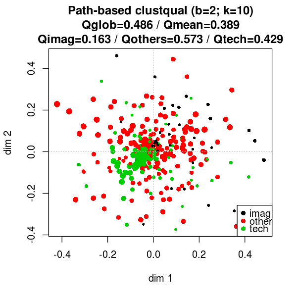


## Same Class Items among k Nearest neighbours
local measure


```R
kNN_tokvecs <- function(clusterclass, k=NULL){
    semvar6<-clusterqualkNN(tokvecs6, d6[,clusterclass], k=k)
    semvar10<-clusterqualkNN(tokvecs10, d10[,clusterclass], k=k)
    make_col <- function(semvardf, df_name){
        freqs <- as.vector(semvardf$classfreqs)
        n <- c(sum(freqs), length(freqs), freqs)
        q <- round(c(semvardf$globqual, semvardf$meanclassqual, semvardf$classqual),3)
        d<-cbind(n, q)
        row.names(d)<-c('global separability', 'mean class separability', names(semvardf$classqual))
        colnames(d)<-c(paste0(df_name, '_n'), paste0(df_name, '_q'))
        return(d)
    }
    cat(paste0('Same Class Items among k Nearest neighbours based separability, based on ', clusterclass), '\n')
    cat(paste0('k: ', semvar6$k, '\n'))
    print(cbind(make_col(semvar6, '6k'), make_col(semvar10, '10k')))
    options(repr.plot.width=5, repr.plot.height=5)
    plot(semvar6, coord6)
    plot(semvar10, coord10)
    }
```


```R
kNN_clouds <- function(clusterclass, k=NULL){
    semvar6<-clusterqualkNN(dist6, c6[,clusterclass], k=k)
    semvar10<-clusterqualkNN(dist10, c10[,clusterclass], k=k)
    make_col <- function(semvardf, df_name){
        freqs <- as.vector(semvardf$classfreqs)
        n <- c(sum(freqs), length(freqs), freqs)
        q <- round(c(semvardf$globqual, semvardf$meanclassqual, semvardf$classqual),3)
        d<-cbind(n, q)
        row.names(d)<-c('global separability', 'mean class separability', names(semvardf$classqual))
        colnames(d)<-c(paste0(df_name, '_n'), paste0(df_name, '_q'))
        return(d)
    }
    cat(paste0('Same Class Items among k Nearest neighbours based separability, based on ', clusterclass), '\n')
    cat(paste0('k: ', semvar6$k, '\n'))
    print(cbind(make_col(semvar6, '6k'), make_col(semvar10, '10k')))
    options(repr.plot.width=5, repr.plot.height=5)
    plot(semvar6, coord6)
    plot(semvar10, coord10)
    }
```


```R
kNN_tokvecs('mbroad')
```

    Same Class Items among k Nearest neighbours based separability, based on mbroad 
    k: 34
                            6k_n  6k_q 10k_n 10k_q
    global separability      337 0.871   337 0.870
    mean class separability    2 0.605     2 0.649
    A                         46 0.239    46 0.346
    B                        291 0.971   291 0.953


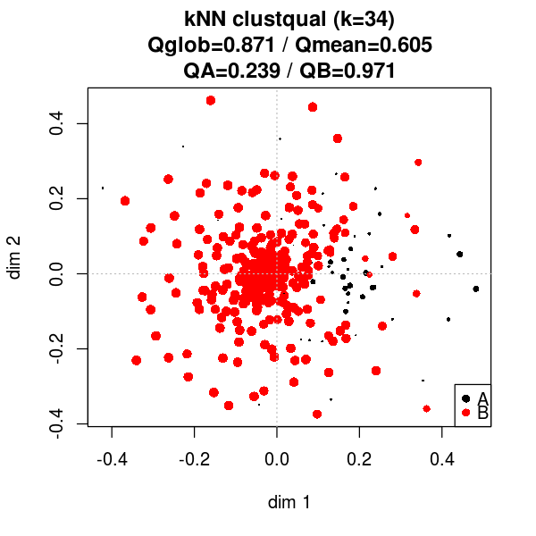


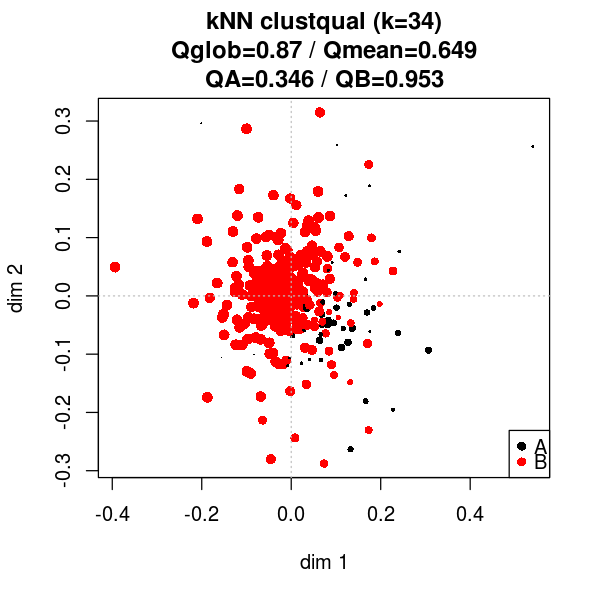


```R
kNN_clouds('mbroad')
```

    Same Class Items among k Nearest neighbours based separability, based on mbroad 
    k: 34
                            6k_n  6k_q 10k_n 10k_q
    global separability      337 0.849   337 0.839
    mean class separability    2 0.656     2 0.631
    A                         46 0.390    46 0.345
    B                        291 0.922   291 0.917


```R
kNN_tokvecs('newBroadGenre')
```

    Same Class Items among k Nearest neighbours based separability, based on newBroadGenre 
    k: 32
                            6k_n  6k_q 10k_n 10k_q
    global separability      337 0.856   337 0.881
    mean class separability    2 0.538     2 0.550
    imaginative               33 0.142    33 0.138
    informative              304 0.933   304 0.962


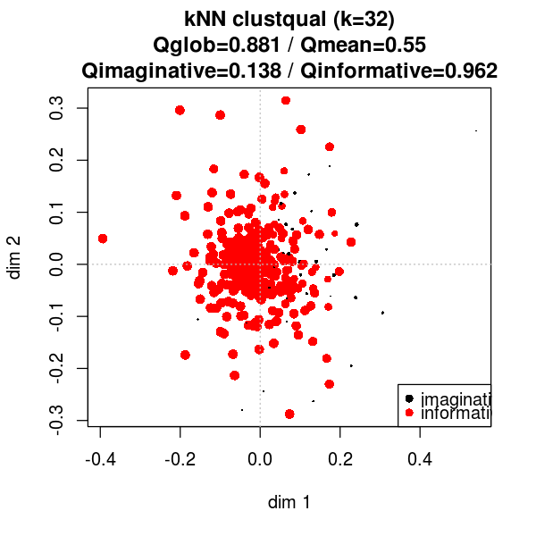


```R
kNN_clouds('newBroadGenre')
```

    Same Class Items among k Nearest neighbours based separability, based on newBroadGenre 
    k: 32
                            6k_n  6k_q 10k_n 10k_q
    global separability      337 0.853   337 0.866
    mean class separability    2 0.554     2 0.574
    imaginative               33 0.182    33 0.211
    informative              304 0.926   304 0.937


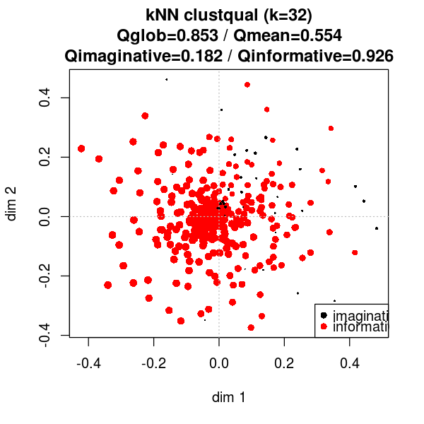


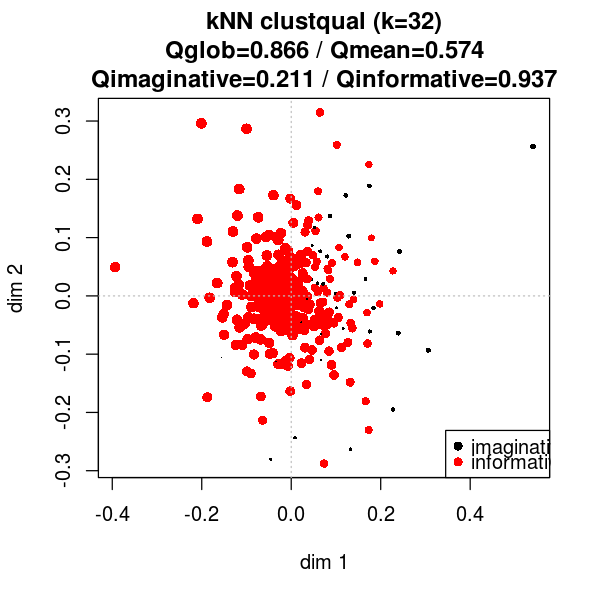


```R
kNN_tokvecs('newBroadGenre', k=15)
```

    Same Class Items among k Nearest neighbours based separability, based on newBroadGenre 
    k: 15
                            6k_n  6k_q 10k_n 10k_q
    global separability      337 0.854   337 0.884
    mean class separability    2 0.544     2 0.565
    imaginative               33 0.160    33 0.168
    informative              304 0.929   304 0.961


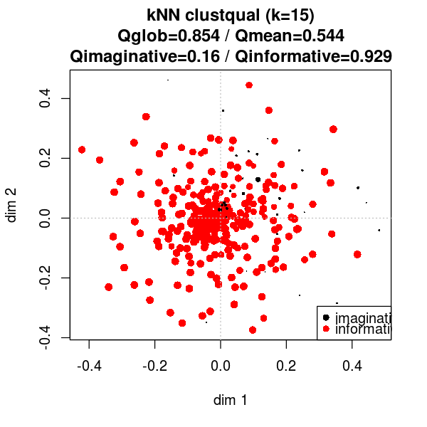


```R
kNN_clouds('newBroadGenre', k=15)
```

    Same Class Items among k Nearest neighbours based separability, based on newBroadGenre 
    k: 15
                            6k_n  6k_q 10k_n 10k_q
    global separability      337 0.851   337 0.863
    mean class separability    2 0.559     2 0.580
    imaginative               33 0.197    33 0.229
    informative              304 0.922   304 0.932


```R
kNN_tokvecs('broadGenre')
```

    Same Class Items among k Nearest neighbours based separability, based on broadGenre 
    k: 32
                            6k_n  6k_q 10k_n 10k_q
    global separability      337 0.520   337 0.517
    mean class separability    3 0.413     3 0.414
    imag                      33 0.142    33 0.138
    others                   194 0.592   194 0.574
    tech                     110 0.506   110 0.530


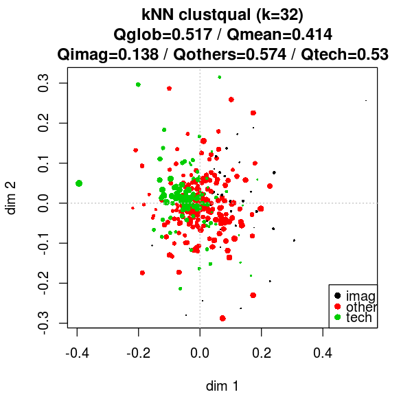


```R
kNN_clouds('broadGenre')
```

    Same Class Items among k Nearest neighbours based separability, based on broadGenre 
    k: 32
                            6k_n  6k_q 10k_n 10k_q
    global separability      337 0.496   337 0.509
    mean class separability    3 0.400     3 0.415
    imag                      33 0.182    33 0.211
    others                   194 0.587   194 0.607
    tech                     110 0.431   110 0.426


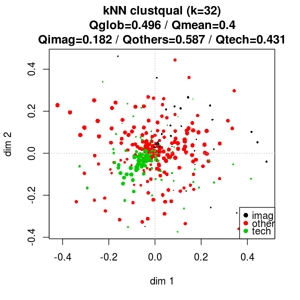


```R
kNN_tokvecs('broadGenre', k=15)
```

    Same Class Items among k Nearest neighbours based separability, based on broadGenre 
    k: 15
                            6k_n  6k_q 10k_n 10k_q
    global separability      337 0.547   337 0.538
    mean class separability    3 0.436     3 0.441
    imag                      33 0.160    33 0.168
    others                   194 0.626   194 0.581
    tech                     110 0.522   110 0.574


```R
kNN_clouds('newBroadGenre', k=15)
```

    Same Class Items among k Nearest neighbours based separability, based on newBroadGenre 
    k: 15
                            6k_n  6k_q 10k_n 10k_q
    global separability      337 0.851   337 0.863
    mean class separability    2 0.559     2 0.580
    imaginative               33 0.197    33 0.229
    informative              304 0.922   304 0.932


