# Separability measures
For a cloud with tokens from all types

## Distance Ratio
General measure

```R
dr_tokvecs('mbroad')
```

    Distance ratio based separability, based on mbroad 
                            6k_n  6k_q 6k_q' 10k_n 10k_q 10k_q'
    global separability      290 1.044 1.016   290 1.055  1.035
    mean class separability    5 1.042 1.025     5 1.049  1.041
    A                         48 0.994 0.987    48 0.996  0.988
    B                         43 1.134 1.071    43 1.133  1.073
    C                        107 1.074 1.085   107 1.106  1.149
    D                         75 0.984 0.980    75 0.982  0.983
    E                         17 1.022 1.003    17 1.029  1.013


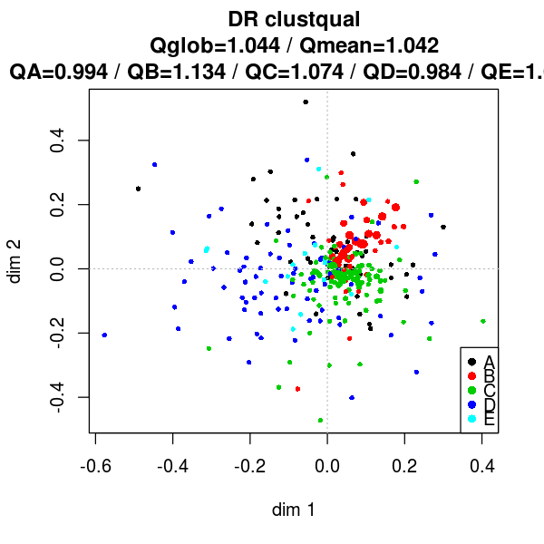


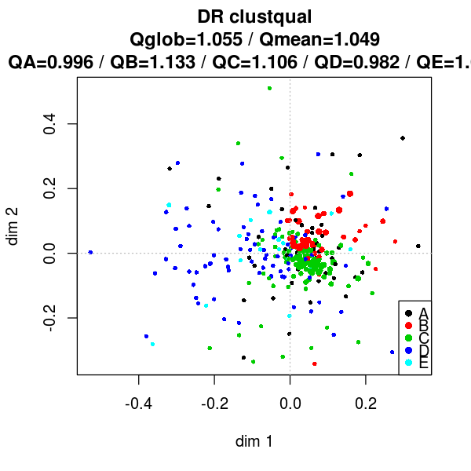


```R
dr_clouds('mbroad')
```

    Distance ratio based separability, based on mbroad 
                            6k_n  6k_q 6k_q' 10k_n 10k_q 10k_q'
    global separability      290 1.324 1.300   290 1.264  1.247
    mean class separability    5 1.253 1.302     5 1.209  1.276
    A                         48 1.015 0.890    48 0.968  0.959
    B                         43 1.563 1.584    43 1.574  1.479
    C                        107 1.651 1.967   107 1.481  1.840
    D                         75 0.976 1.058    75 1.026  1.030
    E                         17 1.063 1.010    17 0.997  1.074


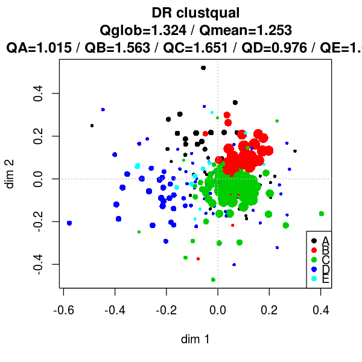


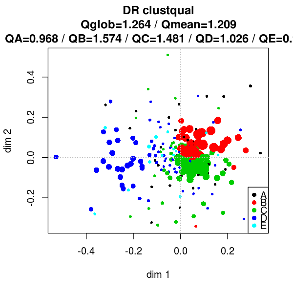


## Silhouette based
General measure


```R
sil_tokvecs('mbroad')
```

    Silhouette based separability, based on mbroad 
                            6k_n   6k_q 10k_n  10k_q
    global separability      290  0.006   290 -0.004
    mean class separability    5  0.005     5 -0.008
    A                         48 -0.037    48 -0.057
    B                         43  0.079    43  0.062
    C                        107  0.030   107  0.030
    D                         75 -0.041    75 -0.055
    E                         17 -0.008    17 -0.021


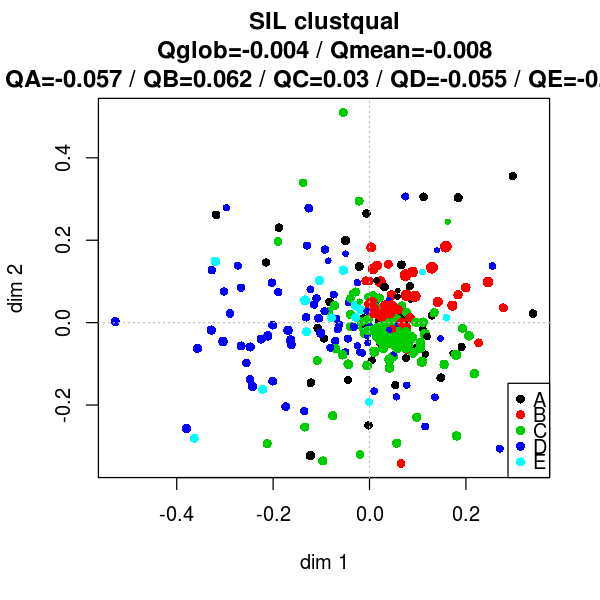


```R
sil_clouds('mbroad')
```

    Silhouette based separability, based on mbroad 
                            6k_n   6k_q 10k_n  10k_q
    global separability      290 -0.036   290 -0.057
    mean class separability    5 -0.070     5 -0.082
    A                         48 -0.244    48 -0.288
    B                         43  0.114    43  0.175
    C                        107  0.139   107  0.046
    D                         75 -0.211    75 -0.159
    E                         17 -0.147    17 -0.186


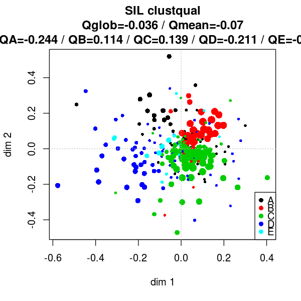


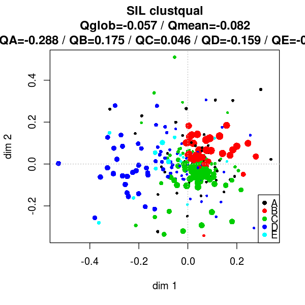


## Same Class Paths based
Local measure


```R
scp_tokvecs('mbroad', k=10)
```

    Same Class Paths based separability, based on mbroad 
    k: 10; Backtracking: 1
                            6k_n  6k_q 10k_n 10k_q
    global separability      290 0.457   290 0.363
    mean class separability    5 0.358     5 0.294
    A                         48 0.209    48 0.121
    B                         43 0.488    43 0.542
    C                        107 0.716   107 0.589
    D                         75 0.317    75 0.163
    E                         17 0.060    17 0.054


```R
scp_clouds('mbroad', k=10)
```

    Same Class Paths based separability, based on mbroad 
    k: 10; Backtracking: 1
                            6k_n  6k_q 10k_n 10k_q
    global separability      290 0.432   290 0.368
    mean class separability    5 0.338     5 0.286
    A                         48 0.234    48 0.125
    B                         43 0.366    43 0.336
    C                        107 0.638   107 0.496
    D                         75 0.388    75 0.433
    E                         17 0.062    17 0.040


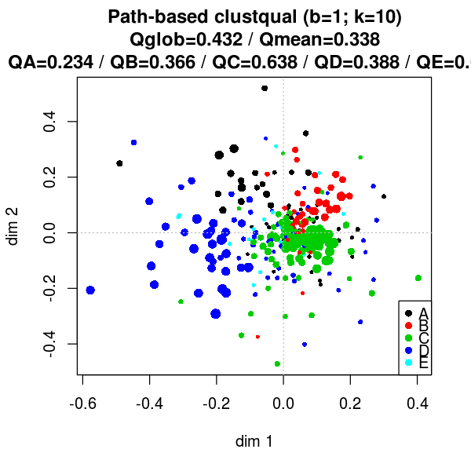


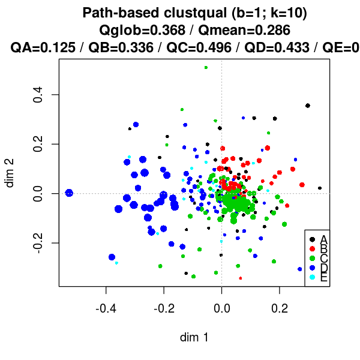


```R
scp_tokvecs('newBroadGenre')
```

    Same Class Paths based separability, based on newBroadGenre 
    k: 29; Backtracking: 1
                            6k_n  6k_q 10k_n 10k_q
    global separability      290 0.654   290 0.719
    mean class separability    2 0.509     2 0.528
    imaginative               76 0.205    76 0.125
    informative              214 0.814   214 0.930


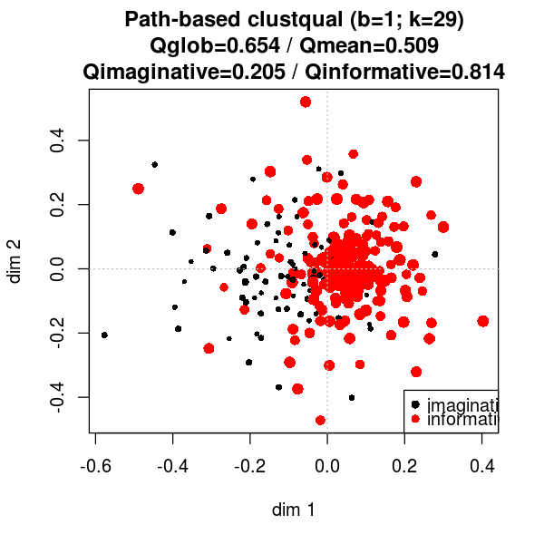


```R
scp_clouds('newBroadGenre')
```

    Same Class Paths based separability, based on newBroadGenre 
    k: 29; Backtracking: 1
                            6k_n  6k_q 10k_n 10k_q
    global separability      290 0.708   290 0.716
    mean class separability    2 0.587     2 0.582
    imaginative               76 0.333    76 0.301
    informative              214 0.842   214 0.863


```R
scp_tokvecs('newBroadGenre', k=15)
```

    Same Class Paths based separability, based on newBroadGenre 
    k: 15; Backtracking: 1
                            6k_n  6k_q 10k_n 10k_q
    global separability      290 0.684   290 0.740
    mean class separability    2 0.539     2 0.555
    imaginative               76 0.233    76 0.167
    informative              214 0.844   214 0.943


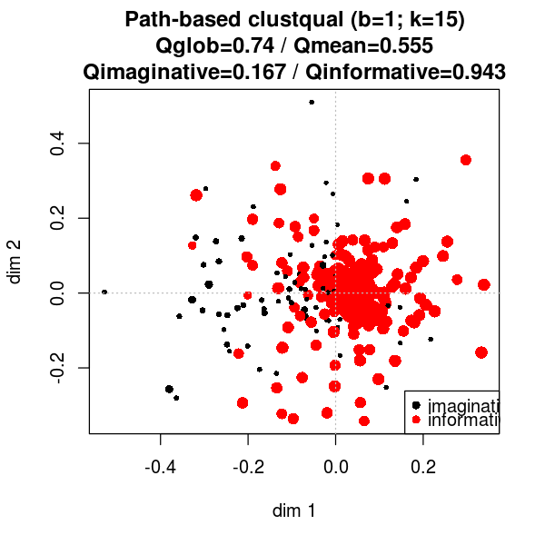


```R
scp_clouds('newBroadGenre', k=15)
```

    Same Class Paths based separability, based on newBroadGenre 
    k: 15; Backtracking: 1
                            6k_n  6k_q 10k_n 10k_q
    global separability      290 0.726   290 0.737
    mean class separability    2 0.634     2 0.633
    imaginative               76 0.439    76 0.414
    informative              214 0.829   214 0.852


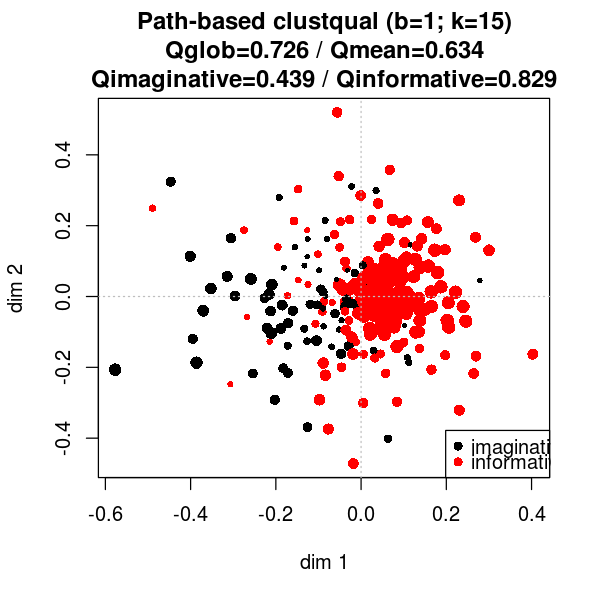


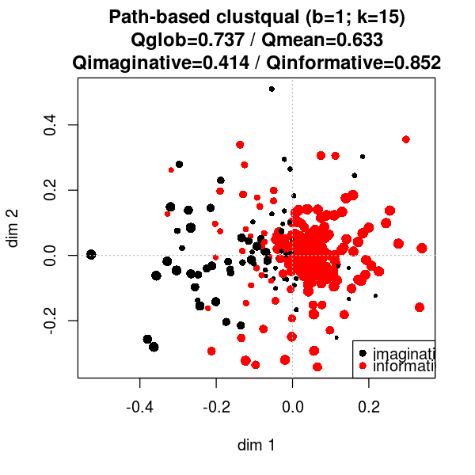


```R
scp_tokvecs('newBroadGenre', k=10)
```

    Same Class Paths based separability, based on newBroadGenre 
    k: 10; Backtracking: 1
                            6k_n  6k_q 10k_n 10k_q
    global separability      290 0.712   290 0.754
    mean class separability    2 0.574     2 0.592
    imaginative               76 0.285    76 0.252
    informative              214 0.863   214 0.932


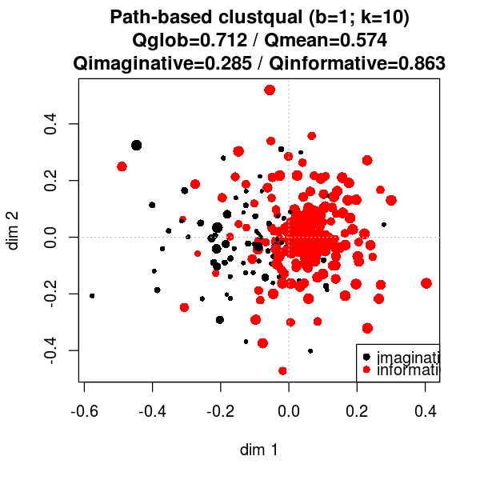


```R
scp_clouds('newBroadGenre', k=10)
```

    Same Class Paths based separability, based on newBroadGenre 
    k: 10; Backtracking: 1
                            6k_n  6k_q 10k_n 10k_q
    global separability      290 0.735   290 0.744
    mean class separability    2 0.654     2 0.652
    imaginative               76 0.482    76 0.457
    informative              214 0.826   214 0.847


```R
scp_tokvecs('newBroadGenre', k=15, b=2)
```

    Same Class Paths based separability, based on newBroadGenre 
    k: 15; Backtracking: 2
                            6k_n  6k_q 10k_n 10k_q
    global separability      290 0.782   290 0.776
    mean class separability    2 0.691     2 0.623
    imaginative               76 0.500    76 0.301
    informative              214 0.883   214 0.945


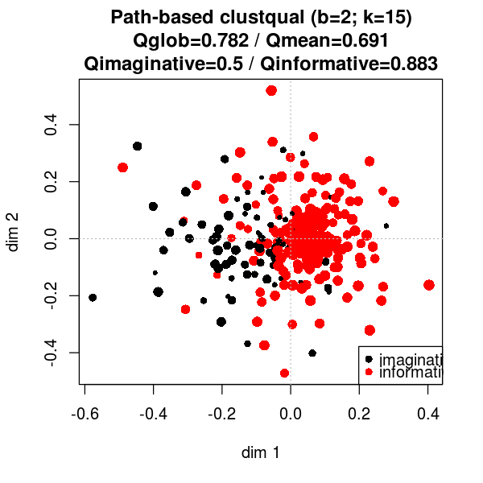


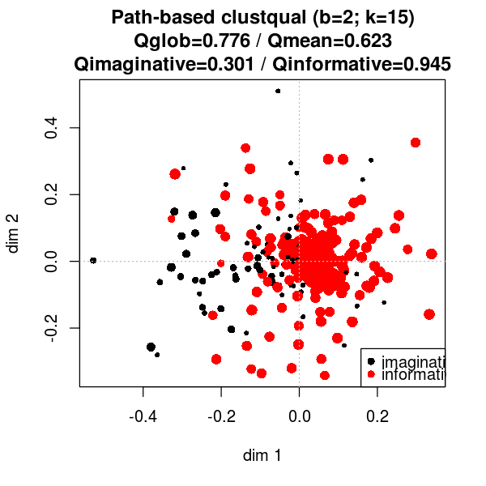


```R
scp_clouds('newBroadGenre', k=15, b=2)
```

    Same Class Paths based separability, based on newBroadGenre 
    k: 15; Backtracking: 2
                            6k_n  6k_q 10k_n 10k_q
    global separability      290 0.784   290 0.789
    mean class separability    2 0.709     2 0.707
    imaginative               76 0.550    76 0.536
    informative              214 0.867   214 0.879


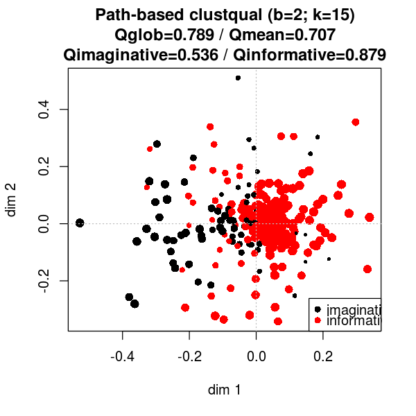


```R
scp_tokvecs('broadGenre')
```

    Same Class Paths based separability, based on broadGenre 
    k: 9; Backtracking: 1
                            6k_n  6k_q 10k_n 10k_q
    global separability      290 0.635   290 0.705
    mean class separability    3 0.371     3 0.396
    imag                      76 0.316    76 0.277
    others                   204 0.785   204 0.898
    tech                      10 0.012    10 0.013


```R
scp_clouds('broadGenre')
```

    Same Class Paths based separability, based on broadGenre 
    k: 9; Backtracking: 1
                            6k_n  6k_q 10k_n 10k_q
    global separability      290 0.684   290 0.699
    mean class separability    3 0.432     3 0.436
    imag                      76 0.493    76 0.467
    others                   204 0.787   204 0.819
    tech                      10 0.016    10 0.021


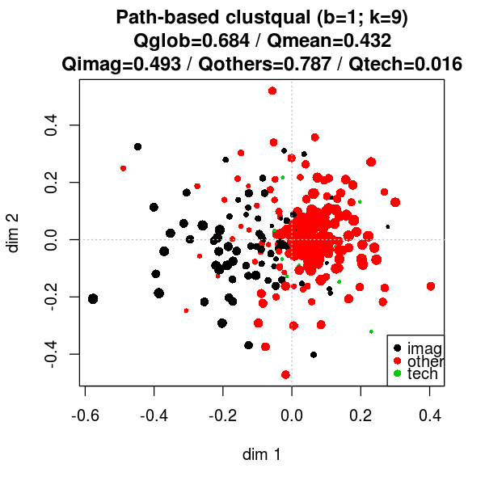


```R
scp_tokvecs('broadGenre', k=15)
```

    Same Class Paths based separability, based on broadGenre 
    k: 9; Backtracking: 1
                            6k_n  6k_q 10k_n 10k_q
    global separability      290 0.635   290 0.705
    mean class separability    3 0.371     3 0.396
    imag                      76 0.316    76 0.277
    others                   204 0.785   204 0.898
    tech                      10 0.012    10 0.013


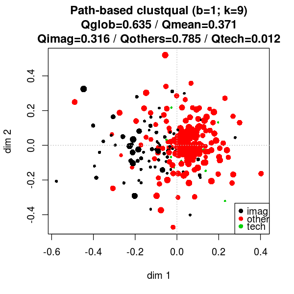


```R
scp_clouds('broadGenre', k=15)
```

    Same Class Paths based separability, based on broadGenre 
    k: 9; Backtracking: 1
                            6k_n  6k_q 10k_n 10k_q
    global separability      290 0.684   290 0.699
    mean class separability    3 0.432     3 0.436
    imag                      76 0.493    76 0.467
    others                   204 0.787   204 0.819
    tech                      10 0.016    10 0.021


```R
scp_tokvecs('broadGenre', k=10)
```

    Same Class Paths based separability, based on broadGenre 
    k: 9; Backtracking: 1
                            6k_n  6k_q 10k_n 10k_q
    global separability      290 0.635   290 0.705
    mean class separability    3 0.371     3 0.396
    imag                      76 0.316    76 0.277
    others                   204 0.785   204 0.898
    tech                      10 0.012    10 0.013


```R
scp_clouds('broadGenre', k=10)
```

    Same Class Paths based separability, based on broadGenre 
    k: 9; Backtracking: 1
                            6k_n  6k_q 10k_n 10k_q
    global separability      290 0.684   290 0.699
    mean class separability    3 0.432     3 0.436
    imag                      76 0.493    76 0.467
    others                   204 0.787   204 0.819
    tech                      10 0.016    10 0.021


```R
scp_tokvecs('broadGenre', k=10, b=2)
```

    Same Class Paths based separability, based on broadGenre 
    k: 9; Backtracking: 2
                            6k_n  6k_q 10k_n 10k_q
    global separability      290 0.690   290 0.729
    mean class separability    3 0.430     3 0.424
    imag                      76 0.474    76 0.359
    others                   204 0.804   204 0.901
    tech                      10 0.012    10 0.013


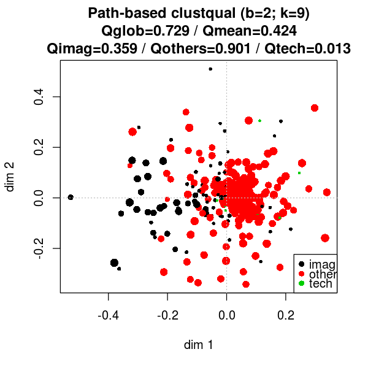


```R
scp_clouds('broadGenre', k=10, b=2)
```

    Same Class Paths based separability, based on broadGenre 
    k: 9; Backtracking: 2
                            6k_n  6k_q 10k_n 10k_q
    global separability      290 0.714   290 0.727
    mean class separability    3 0.456     3 0.461
    imag                      76 0.541    76 0.522
    others                   204 0.812   204 0.839
    tech                      10 0.016    10 0.022


## Same Class Items among k Nearest neighbours
local measure


```R
kNN_tokvecs('mbroad')
```

    Same Class Items among k Nearest neighbours based separability, based on mbroad 
    k: 16
                            6k_n  6k_q 10k_n 10k_q
    global separability      290 0.458   290 0.431
    mean class separability    5 0.379     5 0.363
    A                         48 0.212    48 0.196
    B                         43 0.515    43 0.512
    C                        107 0.652   107 0.593
    D                         75 0.381    75 0.371
    E                         17 0.136    17 0.144


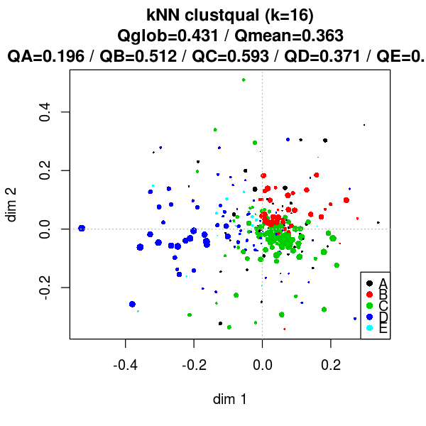


```R
kNN_clouds('mbroad')
```

    Same Class Items among k Nearest neighbours based separability, based on mbroad 
    k: 16
                            6k_n  6k_q 10k_n 10k_q
    global separability      290 0.441   290 0.410
    mean class separability    5 0.360     5 0.327
    A                         48 0.288    48 0.176
    B                         43 0.380    43 0.358
    C                        107 0.584   107 0.537
    D                         75 0.447    75 0.484
    E                         17 0.099    17 0.080


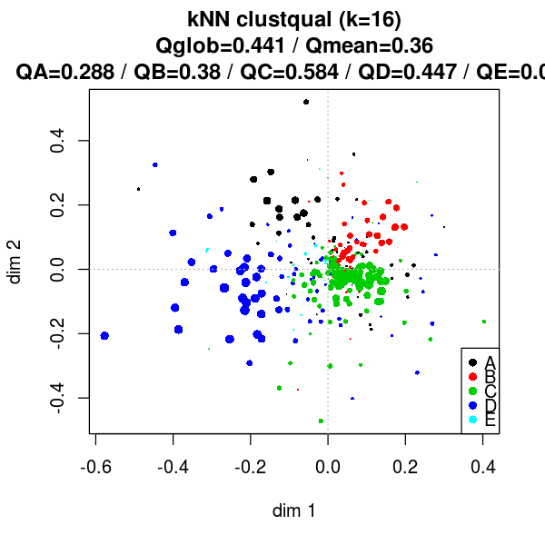


```R
kNN_tokvecs('newBroadGenre')
```

    Same Class Items among k Nearest neighbours based separability, based on newBroadGenre 
    k: 29
                            6k_n  6k_q 10k_n 10k_q
    global separability      290 0.741   290 0.741
    mean class separability    2 0.600     2 0.595
    imaginative               76 0.304    76 0.287
    informative              214 0.896   214 0.902


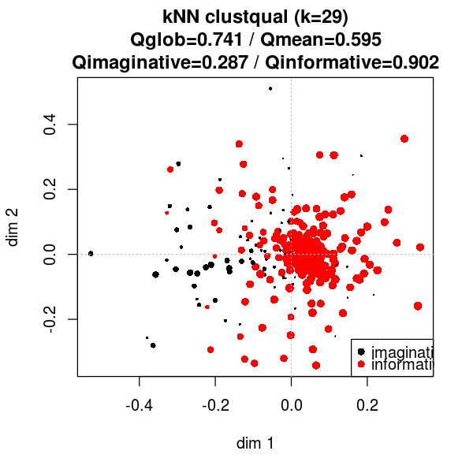


```R
kNN_clouds('newBroadGenre')
```

    Same Class Items among k Nearest neighbours based separability, based on newBroadGenre 
    k: 29
                            6k_n  6k_q 10k_n 10k_q
    global separability      290 0.746   290 0.734
    mean class separability    2 0.663     2 0.644
    imaginative               76 0.488    76 0.455
    informative              214 0.838   214 0.833


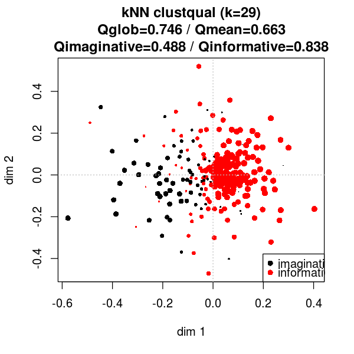


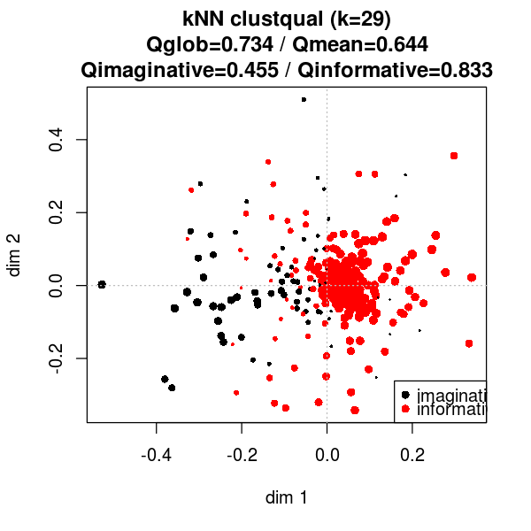


```R
kNN_tokvecs('newBroadGenre', k=15)
```

    Same Class Items among k Nearest neighbours based separability, based on newBroadGenre 
    k: 15
                            6k_n  6k_q 10k_n 10k_q
    global separability      290 0.753   290 0.752
    mean class separability    2 0.630     2 0.620
    imaginative               76 0.372    76 0.342
    informative              214 0.888   214 0.898


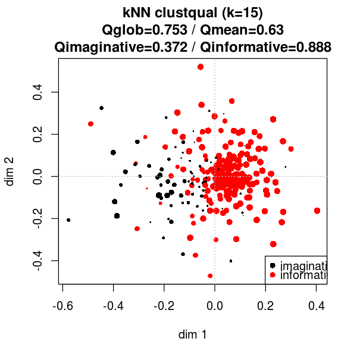


```R
kNN_clouds('newBroadGenre', k=15)
```

    Same Class Items among k Nearest neighbours based separability, based on newBroadGenre 
    k: 15
                            6k_n  6k_q 10k_n 10k_q
    global separability      290 0.747   290 0.741
    mean class separability    2 0.669     2 0.660
    imaginative               76 0.506    76 0.490
    informative              214 0.832   214 0.831


```R
kNN_tokvecs('broadGenre')
```

    Same Class Items among k Nearest neighbours based separability, based on broadGenre 
    k: 9
                            6k_n  6k_q 10k_n 10k_q
    global separability      290 0.720   290 0.721
    mean class separability    3 0.442     3 0.424
    imag                      76 0.434    76 0.382
    others                   204 0.860   204 0.882
    tech                      10 0.031    10 0.007


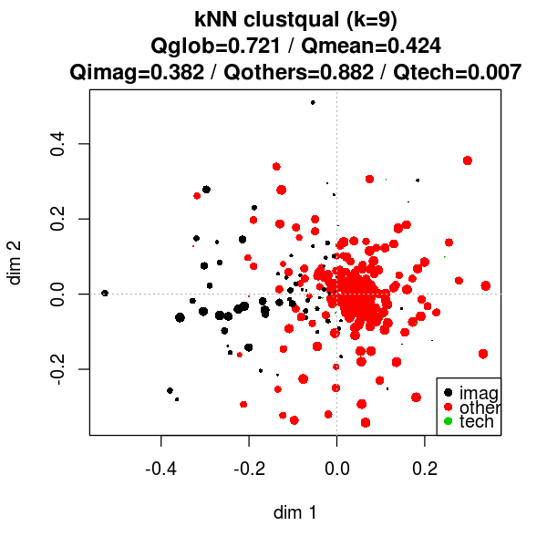


```R
kNN_clouds('broadGenre')
```

    Same Class Items among k Nearest neighbours based separability, based on broadGenre 
    k: 9
                            6k_n  6k_q 10k_n 10k_q
    global separability      290 0.695   290 0.700
    mean class separability    3 0.439     3 0.451
    imag                      76 0.520    76 0.509
    others                   204 0.794   204 0.804
    tech                      10 0.004    10 0.040


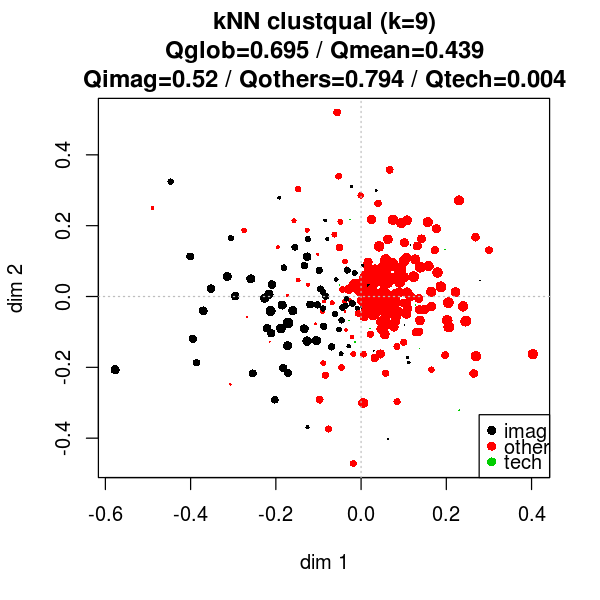


```R
kNN_tokvecs('broadGenre', k=15)
```

    Same Class Items among k Nearest neighbours based separability, based on broadGenre 
    k: 15
                            6k_n  6k_q 10k_n 10k_q
    global separability      290 0.710   290 0.712
    mean class separability    3 0.421     3 0.411
    imag                      76 0.372    76 0.342
    others                   204 0.869   204 0.884
    tech                      10 0.022    10 0.008


```R
kNN_clouds('newBroadGenre', k=15)
```

    Same Class Items among k Nearest neighbours based separability, based on newBroadGenre 
    k: 15
                            6k_n  6k_q 10k_n 10k_q
    global separability      290 0.747   290 0.741
    mean class separability    2 0.669     2 0.660
    imaginative               76 0.506    76 0.490
    informative              214 0.832   214 0.831


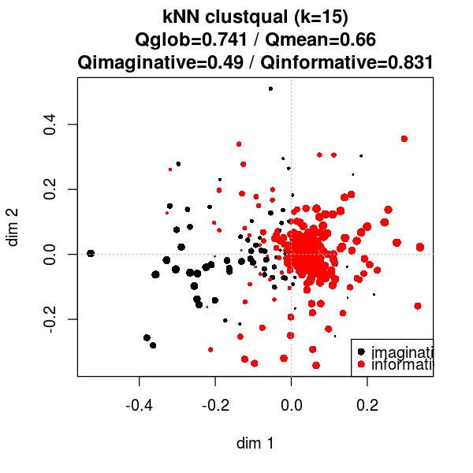

