```R
options(jupyter.plot_mimetypes = c("text/plain", "image/png" )) # to ensure better graphs?
```

# Separability measures
For a cloud with tokens from all types


```R
library(semvar); library(RcppCNPy); library(rjson); library(repr)
```

Function to read the original distance matrices (before multidimensional scaling)


```R
get_tokvecs <- function(input_directory, filename){
  input_file = paste0(input_directory, filename)
  temp <- unzip(input_file, unzip="internal")
  tokvecs <- npyLoad(temp[2])
  metadata <- fromJSON(file=temp[1])
  dimid2item <- names(metadata$`dim-freq-dict`)
  dimnames(tokvecs) <- list(dimid2item, dimid2item)
  file.remove(temp[1], temp[2])
  return(tokvecs)
}
```

Loading variables for classification


```R
semcor = read.delim('../semcor.data.csv')
```


```R
get_d <- function(tokvecs){
  d.rows <- data.frame(factor(rownames(tokvecs)))
  colnames(d.rows)<-'id'
  d <- merge.data.frame(d.rows, semcor, by='id')
  return(droplevels(d))
}
```

Creating a dataframe with filenames and parameters, to select the correct filenames by selecting the parameters of the cloud.


```R
tokvecs_dir = "/home/mariana/Python3wf/output/token_matrices/COHAweight/"
nomds_files = data.frame(factor(dir(tokvecs_dir)))
colnames(nomds_files)='files'
```


```R
pattern = '^COHA.([a-z_]+)(.sample)?.socc(10k|6k).(nona|info|imag|others|tech)?.?min(\\d(_5)?).ttmx.dist.pac'
nomds_files$subset = gsub(pattern, '\\1', nomds_files$files)
nomds_files$socc = gsub(pattern, '\\3', nomds_files$files)
nomds_files$subsubset = gsub(pattern,'\\4', nomds_files$files)
nomds_files$threshold = gsub(pattern, '\\5', nomds_files$files)
nomds_files[nomds_files$subsubset != 'nona', 'subsubset']<-'all'
```

Doing the same for clouds after MDS


```R
clouds_dir = "/home/mariana/delhikiev.github.io/COHAweight/"
mds_files = data.frame(factor(dir(clouds_dir, pattern='.+tsv')))
colnames(mds_files)='files'
```


```R
pattern = '^COHA.([a-z_]+)(.sample)?.socc(10k|6k).(nona|info|imag|tech|others)?.?min(\\d(_5)?).tsv'
mds_files$subset = gsub(pattern, '\\1', mds_files$files)
mds_files$socc = gsub(pattern, '\\3', mds_files$files)
mds_files$subsubset = gsub(pattern,'\\4', mds_files$files)
mds_files$threshold = gsub(pattern, '\\5', mds_files$files)
mds_files[mds_files$subsubset != 'nona', 'subsubset']<-'all'
```

Selecting parameters


```R
subset = 'state'
nona = 'all'
threshold = '1'
```


```R
tokvecs6_fn = as.character(nomds_files[nomds_files$subset == subset & nomds_files$socc == '6k' & nomds_files$threshold == threshold & nomds_files$subsubset == nona, 'files'])
tokvecs10_fn = as.character(nomds_files[nomds_files$subset == subset & nomds_files$socc == '10k' & nomds_files$threshold == threshold & nomds_files$subsubset == nona, 'files'])
```


```R
cloud6_fn = as.character(mds_files[mds_files$subset == subset & mds_files$socc == '6k' & mds_files$threshold == threshold & mds_files$subsubset == nona, 'files'])
cloud10_fn = as.character(mds_files[mds_files$subset == subset & mds_files$socc == '10k' & mds_files$threshold == threshold & mds_files$subsubset == nona, 'files'])
```

Loading the files and getting dataframes.
* _tokvecs_ are the distance matrices before MDS.
* _d_ are dataframes with the categorial data for the tokens in the distance matrices.
* _c_ are the clouds after MDS: these dataframes include the coordinates for the clouds and categorial data.
* _coord_ are the columns with the coordinates of the clouds from the _c_ dataframes.
* _dist_ are the distance matrices built from _coord_.

The order of the tokens is the same in all cases: the _c_ dataframes were originally generated from the _tokvecs_ files and the _d_ dataframes were created with _merge.data.frame_, prioritizing the order of _tokvecs_ over the _semcor.data.csv_ dataframe.


```R
tokvecs6 <-get_tokvecs(tokvecs_dir, tokvecs6_fn)
tokvecs10 <-get_tokvecs(tokvecs_dir, tokvecs10_fn)
```


```R
d6 <- get_d(tokvecs6)
d10 <- get_d(tokvecs10)
```

Delete the rows without mari-senses (with NAs, which had been transformed to 'Z') to avoid senseless tiny classes.


```R
tokvecs6<-tokvecs6[-which(d6$mari2=='Z'),-which(d6$mari2=='Z')]
d6<-droplevels(d6[-which(d6$mari2=='Z'),])
tokvecs10<-tokvecs10[-which(d10$mari2=='Z'),-which(d10$mari2=='Z')]
d10<-droplevels(d10[-which(d10$mari2=='Z'),])
```


```R
c6 <- read.delim(paste0(clouds_dir, cloud6_fn))
c10 <- read.delim(paste0(clouds_dir, cloud10_fn))
coord6 <- c6[,c('model.x', 'model.y')]
coord10 <- c10[,c('model.x', 'model.y')]
dist6<-dist(coord6)
dist10 <-dist(coord10)
```

## Distance Ratio
General measure


```R
dr_tokvecs <- function(clusterclass){
    semvar6<-clusterqualDR(tokvecs6, d6[,clusterclass])
    semvar10<-clusterqualDR(tokvecs10, d10[,clusterclass])
    make_col <- function(semvardf, df_name){
        freqs <- as.vector(semvardf$classfreqs)
        n <- c(sum(freqs), length(freqs), freqs)
        q <- round(c(semvardf$globqual, semvardf$meanclassqual, semvardf$classqual),3)
        q2 <- round(c(semvardf$globqual2, semvardf$meanclassqual2, semvardf$classqual2),3)
        d<-cbind(n, q, q2)
        row.names(d)<-c('global separability', 'mean class separability', names(semvardf$classqual))
        colnames(d)<-c(paste0(df_name, '_n'), paste0(df_name, '_q'), paste0(df_name, "_q'"))
        return(d)
    }
    cat(paste0('Distance ratio based separability, based on ', clusterclass), '\n')
    print(cbind(make_col(semvar6, '6k'), make_col(semvar10, '10k')))
    options(repr.plot.width=5, repr.plot.height=5)
    plot(semvar6, coord6)
    plot(semvar10, coord10)
    }
```


```R
dr_clouds <- function(clusterclass){
    semvar6<-clusterqualDR(dist6, c6[,clusterclass])
    semvar10<-clusterqualDR(dist10, c10[,clusterclass])
    make_col <- function(semvardf, df_name){
        freqs <- as.vector(semvardf$classfreqs)
        n <- c(sum(freqs), length(freqs), freqs)
        q <- round(c(semvardf$globqual, semvardf$meanclassqual, semvardf$classqual),3)
        q2 <- round(c(semvardf$globqual2, semvardf$meanclassqual2, semvardf$classqual2),3)
        d<-cbind(n, q, q2)
        row.names(d)<-c('global separability', 'mean class separability', names(semvardf$classqual))
        colnames(d)<-c(paste0(df_name, '_n'), paste0(df_name, '_q'), paste0(df_name, "_q'"))
        return(d)
    }
    cat(paste0('Distance ratio based separability, based on ', clusterclass), '\n')
    print(cbind(make_col(semvar6, '6k'), make_col(semvar10, '10k')))
    options(repr.plot.width=5, repr.plot.height=5)
    plot(semvar6, coord6)
    plot(semvar10, coord10)
    }
```


```R
dr_tokvecs('mbroad')
```

    Distance ratio based separability, based on mbroad 
                            6k_n  6k_q 6k_q' 10k_n 10k_q 10k_q'
    global separability      495 1.024 1.027   492 1.009  1.012
    mean class separability    4 1.012 1.006     4 1.007  1.002
    A                        402 1.030 1.033   398 1.011  1.013
    B                         22 1.050 1.030    27 1.033  1.032
    C                         36 0.985 0.988    34 1.011  0.997
    D                         35 0.985 0.974    33 0.971  0.967


```R
dr_clouds('mbroad')
```

    Distance ratio based separability, based on mbroad 
                            6k_n  6k_q 6k_q' 10k_n 10k_q 10k_q'
    global separability      495 0.944 0.922   492 0.943  0.932
    mean class separability    4 1.137 1.196     4 1.083  1.054
    A                        402 0.890 0.894   398 0.896  0.899
    B                         22 1.497 1.711    27 1.219  1.084
    C                         36 0.944 0.958    34 0.993  1.028
    D                         35 1.216 1.223    33 1.224  1.205


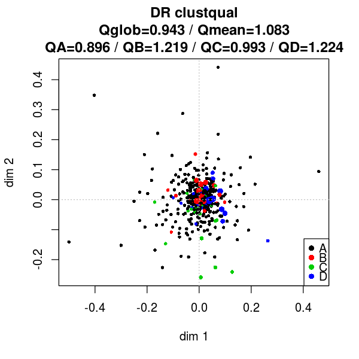


## Silhouette based
General measure


```R
sil_tokvecs <- function(clusterclass){
    semvar6<-clusterqualSIL(tokvecs6, d6[,clusterclass])
    semvar10<-clusterqualSIL(tokvecs10, d10[,clusterclass])
    make_col <- function(semvardf, df_name){
        freqs <- as.vector(semvardf$classfreqs)
        n <- c(sum(freqs), length(freqs), freqs)
        q <- round(c(semvardf$globqual, semvardf$meanclassqual, semvardf$classqual),3)
        d<-cbind(n, q)
        row.names(d)<-c('global separability', 'mean class separability', names(semvardf$classqual))
        colnames(d)<-c(paste0(df_name, '_n'), paste0(df_name, '_q'))
        return(d)
    }
    cat(paste0('Silhouette based separability, based on ', clusterclass), '\n')
    print(cbind(make_col(semvar6, '6k'), make_col(semvar10, '10k')))
    options(repr.plot.width=5, repr.plot.height=5)
    plot(semvar6, coord6)
    plot(semvar10, coord10)
    }
```


```R
sil_clouds <- function(clusterclass){
    semvar6<-clusterqualSIL(dist6, c6[,clusterclass])
    semvar10<-clusterqualSIL(dist10, c10[,clusterclass])
    make_col <- function(semvardf, df_name){
        freqs <- as.vector(semvardf$classfreqs)
        n <- c(sum(freqs), length(freqs), freqs)
        q <- round(c(semvardf$globqual, semvardf$meanclassqual, semvardf$classqual),3)
        d<-cbind(n, q)
        row.names(d)<-c('global separability', 'mean class separability', names(semvardf$classqual))
        colnames(d)<-c(paste0(df_name, '_n'), paste0(df_name, '_q'))
        return(d)
    }
    cat(paste0('Silhouette based separability, based on ', clusterclass), '\n')
    print(cbind(make_col(semvar6, '6k'), make_col(semvar10, '10k')))
    options(repr.plot.width=5, repr.plot.height=5)
    plot(semvar6, coord6)
    plot(semvar10, coord10)
    }
```


```R
sil_tokvecs('mbroad')
```

    Silhouette based separability, based on mbroad 
                            6k_n   6k_q 10k_n  10k_q
    global separability      495 -0.004   492 -0.021
    mean class separability    4 -0.003     4 -0.016
    A                        402 -0.002   398 -0.023
    B                         22  0.041    27  0.018
    C                         36 -0.026    34 -0.010
    D                         35 -0.025    33 -0.050


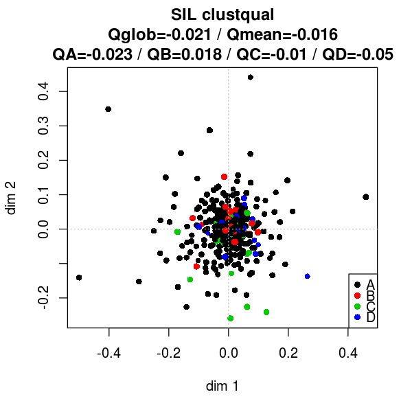


```R
sil_clouds('mbroad')
```

    Silhouette based separability, based on mbroad 
                            6k_n   6k_q 10k_n  10k_q
    global separability      495 -0.228   492 -0.181
    mean class separability    4 -0.133     4 -0.100
    A                        402 -0.252   398 -0.207
    B                         22  0.141    27  0.014
    C                         36 -0.262    34 -0.185
    D                         35 -0.158    33 -0.020


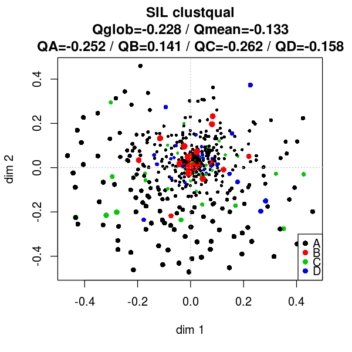


## Same Class Paths based
Local measure


```R
scp_tokvecs <- function(clusterclass, k=NULL, b=FALSE){
    semvar6<-clusterqualSCP(tokvecs6, d6[,clusterclass], k=k, backtracking=b)
    semvar10<-clusterqualSCP(tokvecs10, d10[,clusterclass], k=k, backtracking=b)
    make_col <- function(semvardf, df_name){
        freqs <- as.vector(semvardf$classfreqs)
        n <- c(sum(freqs), length(freqs), freqs)
        q <- round(c(semvardf$globqual, semvardf$meanclassqual, semvardf$classqual),3)
        d<-cbind(n, q)
        row.names(d)<-c('global separability', 'mean class separability', names(semvardf$classqual))
        colnames(d)<-c(paste0(df_name, '_n'), paste0(df_name, '_q'))
        return(d)
    }
    cat(paste0('Same Class Paths based separability, based on ', clusterclass), '\n')
    cat(paste0('k: ', semvar6$k, '; Backtracking: ', semvar6$backtracking, '\n'))
    print(cbind(make_col(semvar6, '6k'), make_col(semvar10, '10k')))
    options(repr.plot.width=5, repr.plot.height=5)
    plot(semvar6, coord6)
    plot(semvar10, coord10)
    }
```


```R
scp_clouds <- function(clusterclass, k=NULL, b=FALSE){
    semvar6<-clusterqualSCP(dist6, c6[,clusterclass], k=k, backtracking=b)
    semvar10<-clusterqualSCP(dist10, c10[,clusterclass], k=k, backtracking=b)
    make_col <- function(semvardf, df_name){
        freqs <- as.vector(semvardf$classfreqs)
        n <- c(sum(freqs), length(freqs), freqs)
        q <- round(c(semvardf$globqual, semvardf$meanclassqual, semvardf$classqual),3)
        d<-cbind(n, q)
        row.names(d)<-c('global separability', 'mean class separability', names(semvardf$classqual))
        colnames(d)<-c(paste0(df_name, '_n'), paste0(df_name, '_q'))
        return(d)
    }
    cat(paste0('Same Class Paths based separability, based on ', clusterclass), '\n')
    cat(paste0('k: ', semvar6$k, '; Backtracking: ', semvar6$backtracking, '\n'))
    print(cbind(make_col(semvar6, '6k'), make_col(semvar10, '10k')))
    options(repr.plot.width=5, repr.plot.height=5)
    plot(semvar6, coord6)
    plot(semvar10, coord10)
    }
```


```R
scp_tokvecs('mbroad', k=10)
```

    Same Class Paths based separability, based on mbroad 
    k: 10; Backtracking: 1
                            6k_n  6k_q 10k_n 10k_q
    global separability      495 0.689   492 0.665
    mean class separability    4 0.255     4 0.237
    A                        402 0.834   398 0.811
    B                         22 0.068    27 0.032
    C                         36 0.056    34 0.050
    D                         35 0.062    33 0.054


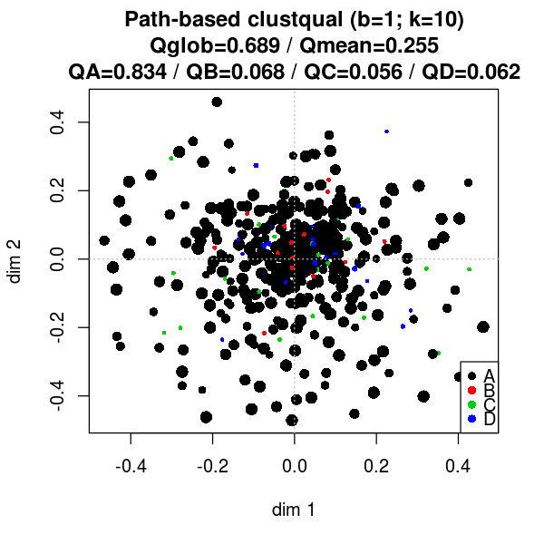


```R
scp_clouds('mbroad', k=10)
```

    Same Class Paths based separability, based on mbroad 
    k: 10; Backtracking: 1
                            6k_n  6k_q 10k_n 10k_q
    global separability      495 0.655   492 0.652
    mean class separability    4 0.238     4 0.239
    A                        402 0.794   398 0.793
    B                         22 0.050    27 0.046
    C                         36 0.048    34 0.053
    D                         35 0.059    33 0.064


```R
scp_tokvecs('newBroadGenre')
```

    Same Class Paths based separability, based on newBroadGenre 
    k: 12; Backtracking: 1
                            6k_n  6k_q 10k_n 10k_q
    global separability      495 0.927   492 0.951
    mean class separability    2 0.479     2 0.495
    imaginative               13 0.006    17 0.004
    informative              482 0.952   475 0.985


```R
scp_clouds('newBroadGenre')
```

    Same Class Paths based separability, based on newBroadGenre 
    k: 12; Backtracking: 1
                            6k_n  6k_q 10k_n 10k_q
    global separability      495 0.928   492 0.922
    mean class separability    2 0.484     2 0.486
    imaginative               13 0.014    17 0.017
    informative              482 0.953   475 0.955


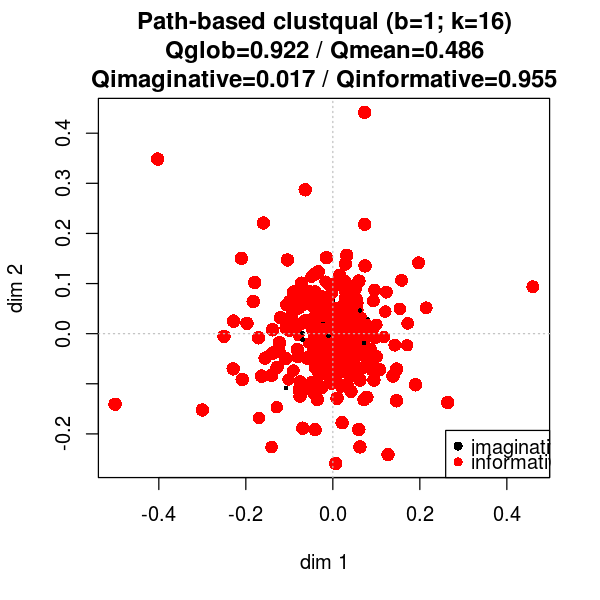


```R
scp_tokvecs('newBroadGenre', k=15)
```

    Same Class Paths based separability, based on newBroadGenre 
    k: 12; Backtracking: 1
                            6k_n  6k_q 10k_n 10k_q
    global separability      495 0.927   492 0.951
    mean class separability    2 0.479     2 0.495
    imaginative               13 0.006    17 0.005
    informative              482 0.952   475 0.985


```R
scp_clouds('newBroadGenre', k=15)
```

    Same Class Paths based separability, based on newBroadGenre 
    k: 12; Backtracking: 1
                            6k_n  6k_q 10k_n 10k_q
    global separability      495 0.928   492 0.923
    mean class separability    2 0.484     2 0.487
    imaginative               13 0.014    17 0.018
    informative              482 0.953   475 0.955


```R
scp_tokvecs('newBroadGenre', k=10)
```

    Same Class Paths based separability, based on newBroadGenre 
    k: 10; Backtracking: 1
                            6k_n  6k_q 10k_n 10k_q
    global separability      495 0.931   492 0.951
    mean class separability    2 0.481     2 0.495
    imaginative               13 0.007    17 0.006
    informative              482 0.955   475 0.984


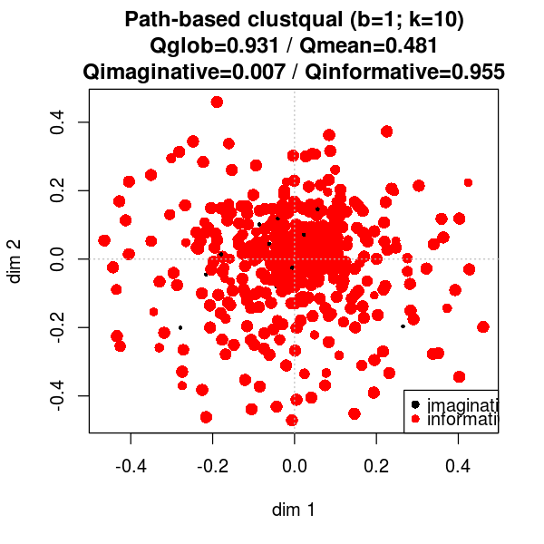


```R
scp_clouds('newBroadGenre', k=10)
```

    Same Class Paths based separability, based on newBroadGenre 
    k: 10; Backtracking: 1
                            6k_n  6k_q 10k_n 10k_q
    global separability      495 0.931   492 0.929
    mean class separability    2 0.486     2 0.493
    imaginative               13 0.017    17 0.025
    informative              482 0.955   475 0.961


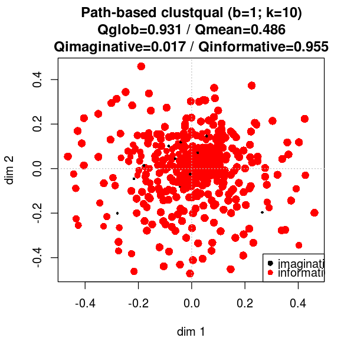


```R
scp_tokvecs('newBroadGenre', k=15, b=2)
```

    Same Class Paths based separability, based on newBroadGenre 
    k: 12; Backtracking: 2
                            6k_n  6k_q 10k_n 10k_q
    global separability      495 0.932   492 0.953
    mean class separability    2 0.482     2 0.496
    imaginative               13 0.007    17 0.005
    informative              482 0.957   475 0.987


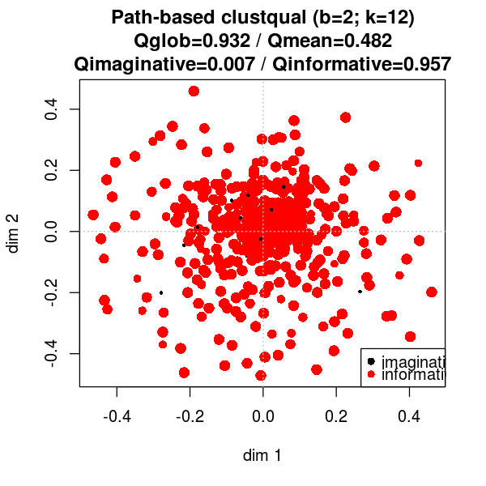


```R
scp_clouds('newBroadGenre', k=15, b=2)
```

    Same Class Paths based separability, based on newBroadGenre 
    k: 12; Backtracking: 2
                            6k_n  6k_q 10k_n 10k_q
    global separability      495 0.933   492 0.931
    mean class separability    2 0.486     2 0.492
    imaginative               13 0.015    17 0.021
    informative              482 0.958   475 0.964


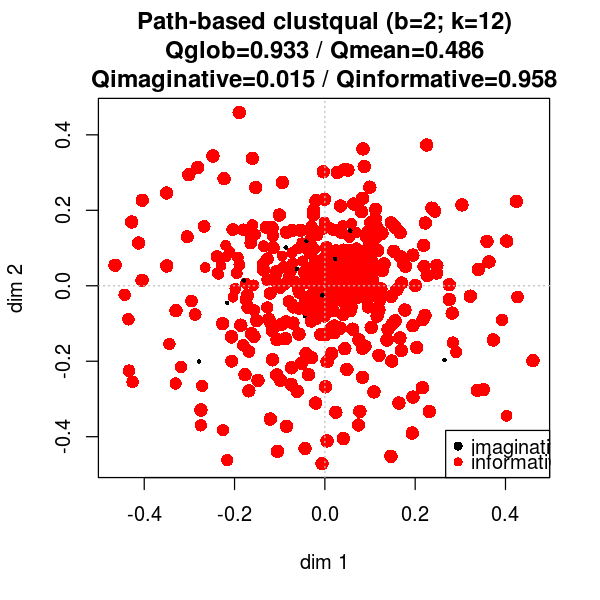


```R
scp_tokvecs('broadGenre')
```

    Same Class Paths based separability, based on broadGenre 
    k: 12; Backtracking: 1
                            6k_n  6k_q 10k_n 10k_q
    global separability      495 0.596   492 0.600
    mean class separability    3 0.417     3 0.422
    imag                      13 0.006    17 0.004
    others                   256 0.458   256 0.508
    tech                     226 0.786   219 0.754


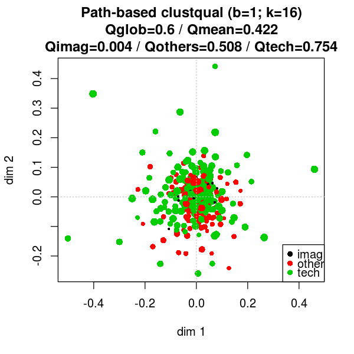


```R
scp_clouds('broadGenre')
```

    Same Class Paths based separability, based on broadGenre 
    k: 12; Backtracking: 1
                            6k_n  6k_q 10k_n 10k_q
    global separability      495 0.484   492 0.442
    mean class separability    3 0.334     3 0.307
    imag                      13 0.014    17 0.017
    others                   256 0.543   256 0.523
    tech                     226 0.445   219 0.381


```R
scp_tokvecs('broadGenre', k=15)
```

    Same Class Paths based separability, based on broadGenre 
    k: 12; Backtracking: 1
                            6k_n  6k_q 10k_n 10k_q
    global separability      495 0.596   492 0.602
    mean class separability    3 0.417     3 0.424
    imag                      13 0.006    17 0.005
    others                   256 0.458   256 0.512
    tech                     226 0.786   219 0.754


```R
scp_clouds('broadGenre', k=15)
```

    Same Class Paths based separability, based on broadGenre 
    k: 12; Backtracking: 1
                            6k_n  6k_q 10k_n 10k_q
    global separability      495 0.484   492 0.446
    mean class separability    3 0.334     3 0.310
    imag                      13 0.014    17 0.018
    others                   256 0.543   256 0.525
    tech                     226 0.445   219 0.386


```R
scp_tokvecs('broadGenre', k=10)
```

    Same Class Paths based separability, based on broadGenre 
    k: 10; Backtracking: 1
                            6k_n  6k_q 10k_n 10k_q
    global separability      495 0.605   492 0.619
    mean class separability    3 0.423     3 0.435
    imag                      13 0.007    17 0.006
    others                   256 0.475   256 0.539
    tech                     226 0.788   219 0.760


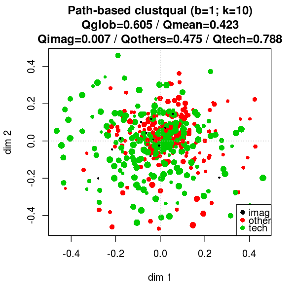


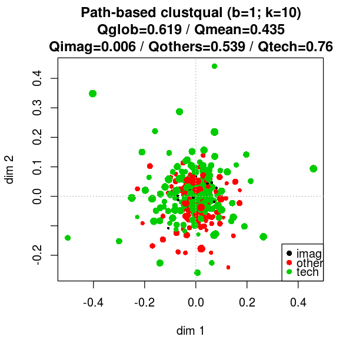


```R
scp_clouds('broadGenre', k=10)
```

    Same Class Paths based separability, based on broadGenre 
    k: 10; Backtracking: 1
                            6k_n  6k_q 10k_n 10k_q
    global separability      495 0.495   492 0.471
    mean class separability    3 0.342     3 0.330
    imag                      13 0.017    17 0.025
    others                   256 0.550   256 0.538
    tech                     226 0.460   219 0.428


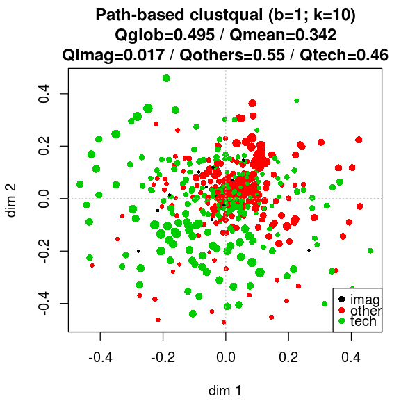


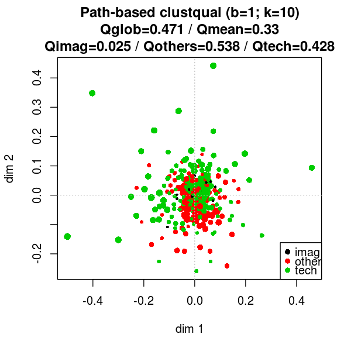


```R
scp_tokvecs('broadGenre', k=10, b=2)
```

    Same Class Paths based separability, based on broadGenre 
    k: 10; Backtracking: 2
                            6k_n  6k_q 10k_n 10k_q
    global separability      495 0.641   492 0.668
    mean class separability    3 0.448     3 0.467
    imag                      13 0.008    17 0.006
    others                   256 0.518   256 0.613
    tech                     226 0.817   219 0.783


```R
scp_clouds('broadGenre', k=10, b=2)
```

    Same Class Paths based separability, based on broadGenre 
    k: 10; Backtracking: 2
                            6k_n  6k_q 10k_n 10k_q
    global separability      495 0.525   492 0.511
    mean class separability    3 0.363     3 0.359
    imag                      13 0.017    17 0.028
    others                   256 0.576   256 0.572
    tech                     226 0.496   219 0.478


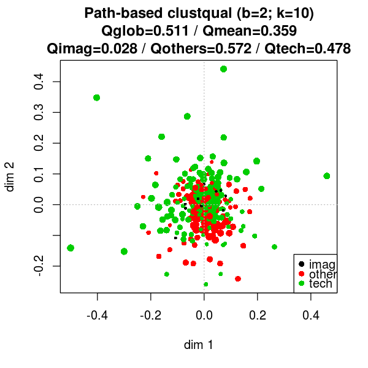


## Same Class Items among k Nearest neighbours
local measure


```R
kNN_tokvecs <- function(clusterclass, k=NULL){
    semvar6<-clusterqualkNN(tokvecs6, d6[,clusterclass], k=k)
    semvar10<-clusterqualkNN(tokvecs10, d10[,clusterclass], k=k)
    make_col <- function(semvardf, df_name){
        freqs <- as.vector(semvardf$classfreqs)
        n <- c(sum(freqs), length(freqs), freqs)
        q <- round(c(semvardf$globqual, semvardf$meanclassqual, semvardf$classqual),3)
        d<-cbind(n, q)
        row.names(d)<-c('global separability', 'mean class separability', names(semvardf$classqual))
        colnames(d)<-c(paste0(df_name, '_n'), paste0(df_name, '_q'))
        return(d)
    }
    cat(paste0('Same Class Items among k Nearest neighbours based separability, based on ', clusterclass), '\n')
    cat(paste0('k: ', semvar6$k, '\n'))
    print(cbind(make_col(semvar6, '6k'), make_col(semvar10, '10k')))
    options(repr.plot.width=5, repr.plot.height=5)
    plot(semvar6, coord6)
    plot(semvar10, coord10)
    }
```


```R
kNN_clouds <- function(clusterclass, k=NULL){
    semvar6<-clusterqualkNN(dist6, c6[,clusterclass], k=k)
    semvar10<-clusterqualkNN(dist10, c10[,clusterclass], k=k)
    make_col <- function(semvardf, df_name){
        freqs <- as.vector(semvardf$classfreqs)
        n <- c(sum(freqs), length(freqs), freqs)
        q <- round(c(semvardf$globqual, semvardf$meanclassqual, semvardf$classqual),3)
        d<-cbind(n, q)
        row.names(d)<-c('global separability', 'mean class separability', names(semvardf$classqual))
        colnames(d)<-c(paste0(df_name, '_n'), paste0(df_name, '_q'))
        return(d)
    }
    cat(paste0('Same Class Items among k Nearest neighbours based separability, based on ', clusterclass), '\n')
    cat(paste0('k: ', semvar6$k, '\n'))
    print(cbind(make_col(semvar6, '6k'), make_col(semvar10, '10k')))
    options(repr.plot.width=5, repr.plot.height=5)
    plot(semvar6, coord6)
    plot(semvar10, coord10)
    }
```


```R
kNN_tokvecs('mbroad')
```

    Same Class Items among k Nearest neighbours based separability, based on mbroad 
    k: 21
                            6k_n  6k_q 10k_n 10k_q
    global separability      495 0.731   492 0.692
    mean class separability    4 0.298     4 0.268
    A                        402 0.876   398 0.837
    B                         22 0.119    27 0.079
    C                         36 0.070    34 0.060
    D                         35 0.129    33 0.096


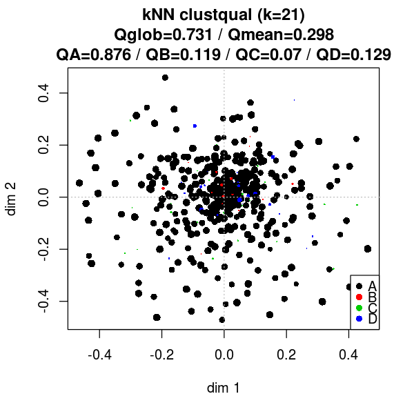


```R
kNN_clouds('mbroad')
```

    Same Class Items among k Nearest neighbours based separability, based on mbroad 
    k: 21
                            6k_n  6k_q 10k_n 10k_q
    global separability      495 0.666   492 0.665
    mean class separability    4 0.244     4 0.252
    A                        402 0.807   398 0.806
    B                         22 0.049    27 0.052
    C                         36 0.047    34 0.075
    D                         35 0.071    33 0.075


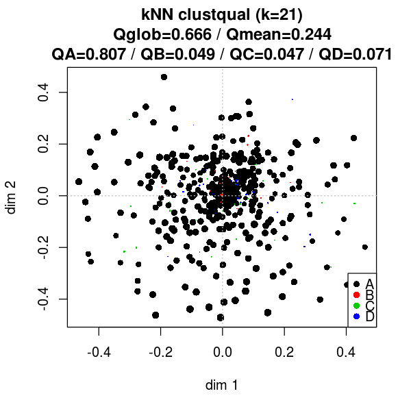


```R
kNN_tokvecs('newBroadGenre')
```

    Same Class Items among k Nearest neighbours based separability, based on newBroadGenre 
    k: 12
                            6k_n  6k_q 10k_n 10k_q
    global separability      495 0.944   492 0.955
    mean class separability    2 0.515     2 0.497
    imaginative               13 0.063    17 0.005
    informative              482 0.968   475 0.989


```R
kNN_clouds('newBroadGenre')
```

    Same Class Items among k Nearest neighbours based separability, based on newBroadGenre 
    k: 12
                            6k_n  6k_q 10k_n 10k_q
    global separability      495 0.945   492 0.935
    mean class separability    2 0.488     2 0.511
    imaginative               13 0.005    17 0.055
    informative              482 0.971   475 0.967


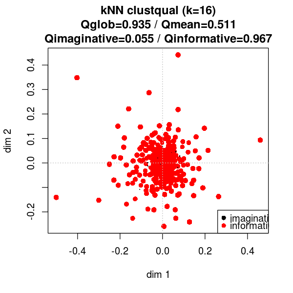


```R
kNN_tokvecs('newBroadGenre', k=15)
```

    Same Class Items among k Nearest neighbours based separability, based on newBroadGenre 
    k: 15
                            6k_n  6k_q 10k_n 10k_q
    global separability      495 0.944   492 0.955
    mean class separability    2 0.510     2 0.497
    imaginative               13 0.053    17 0.005
    informative              482 0.968   475 0.989


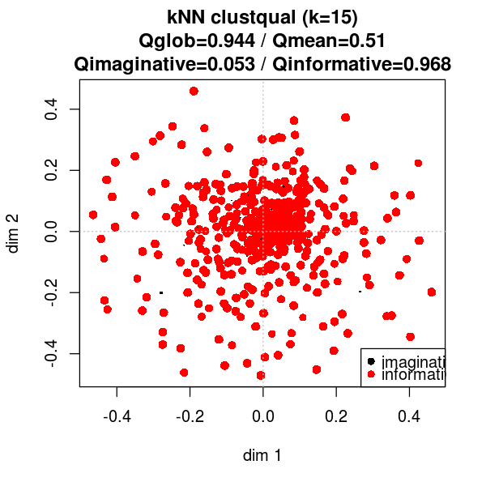


```R
kNN_clouds('newBroadGenre', k=15)
```

    Same Class Items among k Nearest neighbours based separability, based on newBroadGenre 
    k: 15
                            6k_n  6k_q 10k_n 10k_q
    global separability      495 0.946   492 0.935
    mean class separability    2 0.490     2 0.511
    imaginative               13 0.010    17 0.054
    informative              482 0.971   475 0.967


```R
kNN_tokvecs('broadGenre')
```

    Same Class Items among k Nearest neighbours based separability, based on broadGenre 
    k: 12
                            6k_n  6k_q 10k_n 10k_q
    global separability      495 0.573   492 0.556
    mean class separability    3 0.418     3 0.391
    imag                      13 0.063    17 0.005
    others                   256 0.464   256 0.479
    tech                     226 0.726   219 0.689


```R
kNN_clouds('broadGenre')
```

    Same Class Items among k Nearest neighbours based separability, based on broadGenre 
    k: 12
                            6k_n  6k_q 10k_n 10k_q
    global separability      495 0.527   492 0.517
    mean class separability    3 0.361     3 0.371
    imag                      13 0.005    17 0.055
    others                   256 0.578   256 0.582
    tech                     226 0.499   219 0.476


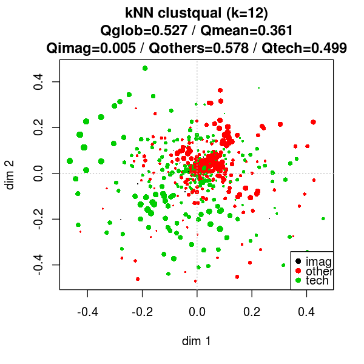


```R
kNN_tokvecs('broadGenre', k=15)
```

    Same Class Items among k Nearest neighbours based separability, based on broadGenre 
    k: 15
                            6k_n  6k_q 10k_n 10k_q
    global separability      495 0.565   492 0.558
    mean class separability    3 0.409     3 0.392
    imag                      13 0.053    17 0.005
    others                   256 0.448   256 0.482
    tech                     226 0.726   219 0.690


```R
kNN_clouds('newBroadGenre', k=15)
```

    Same Class Items among k Nearest neighbours based separability, based on newBroadGenre 
    k: 15
                            6k_n  6k_q 10k_n 10k_q
    global separability      495 0.946   492 0.935
    mean class separability    2 0.490     2 0.511
    imaginative               13 0.010    17 0.054
    informative              482 0.971   475 0.967


